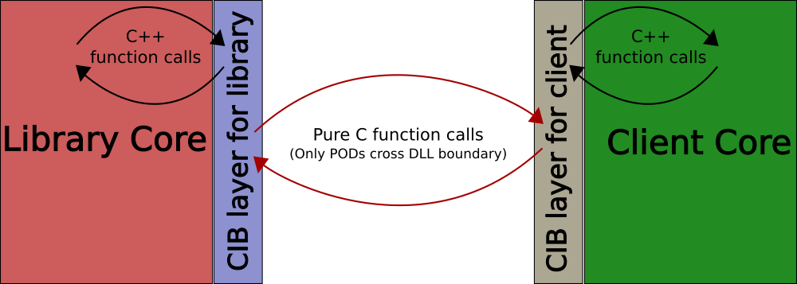

Component Interface Binder (CIB)
================================

[](https://travis-ci.com/satya-das/cib)
[](https://codecov.io/gh/satya-das/cib)
[](https://opensource.org/licenses/MIT)

# CIB

**In a nutshell CIB is the answer to the problem for which C is used for exporting APIs of an application/library even when the application/library itself uses C++ for most of its implementation. C++ is great in expressing API but compiler generated ABI makes it difficult to use to publish compiler independent and ABI stable SDK.**

# Abstract
*C++ components are not ABI compatible and achieving ABI stability is very difficult. Programmers use C for exporting APIs that can be called from across component boundary. ABI compatibility and stability problem of C++ is what makes programmer resort to use of C when in comes to exporting API.
There are some proposals about standard C++ ABI, like [Itanium C++ ABI](http://mentorembedded.github.io/cxx-abi/), that if used by all compilers and that does not change based on compiler switch, will make it possible to have ABI compatible C++ components. But that will still not make components ABI stable.*

## Jargon
1. **ABI Compatibility**: Compatibility of binary C++ components even when they are built with different compilers.
2. **API Stability**: Ability to compile client of a library with newer SDK headers without any change.
3. **ABI Stability**: Ability of binary component to work with newer version of another component without recompiling. Example of ABI stability is the ability of plugin (in binary form) of an application to seemlessly work with newer application.

1\.  [Overview](#overview)  
2\.  [CIB Features](#cibfeatures)  
3\.  [CIB Goals](#cibgoals)  
4\.  [Other Solutions](#othersolutions)  
5\.  [ABI Resilience](#abiresilience)  
6\.  [CIB Architecture](#cibarchitecture)  
7\.  [Feature Progress of CIB tool](#featureprogressofcibtool)  
8\.  [CIB Terminology](#cibterminology)  
8.1\.  [Inline Class](#inlineclass)  
8.2\.  [Shared Class](#sharedclass)  
8.3\.  [Facade Class](#facadeclass)  
8.4\.  [Interface Class](#interfaceclass)  
8.5\.  [Proxy Class](#proxyclass)  
8.6\.  [Handle](#handle)  
9\.  [CIB Architecture Detail](#cibarchitecturedetail)  
9.1\.  [Example - A Simple Class](#example-asimpleclass)  
9.1.1\.  [Running CIB](#runningcib)  
9.1.2\.  [Symbol `__zz_cib_`](#symbol`__zz_cib_`)  
9.1.3\.  [Method Table](#methodtable)  
9.1.4\.  [Unique IDs for all entities.](#uniqueidsforallentities.)  
9.1.5\.  [Library Glue Code](#librarygluecode)  
9.1.6\.  [Library Gateway function](#librarygatewayfunction)  
9.1.7\.  [Import of library gateway function](#importoflibrarygatewayfunction)  
9.1.8\.  [SDK Headers and Proxy Classes](#sdkheadersandproxyclasses)  
9.2\.  [Example - Virtual function and runtime polymorphism](#example-virtualfunctionandruntimepolymorphism)  
9.3\.  [Example - Facade Classes and RTTI](#example-facadeclassesandrtti)  
9.4\.  [Example - Interface Classes](#example-interfaceclasses)  
9.5\.  [Example - Template Classes](#example-templateclasses)  
9.6\.  [Example - Reusing proxy classes.](#example-reusingproxyclasses.)  
9.7\.  [Example - Methods especially virtuals and pure virtuals of private, protected, and public access types.](#example-methodsespeciallyvirtualsandpurevirtualsofprivateprotectedandpublicaccesstypes.)  
10\.  [Demo Project](#demoproject)  
11\.  [Building CIB](#buildingcib)  
11.1\.  [Get the source](#getthesource)  
11.1.1\.  [Configure and build](#configureandbuild)  
12\.  [Implementation Details](#implementationdetails)  
12.1\.  [Parsing Technique](#parsingtechnique)  
12.2\.  [Creating proxy class from handle](#creatingproxyclassfromhandle)  

<a name="overview"></a>

# 1\. Overview
 CIB is an architecture to make it possible to publish compiler independent and ABI stable C++ library.
 This project is also about a tool that implements `cib architecture` for a given library headers.
 CIB architecture allows one binary component to use classes and functions defined in another binary component that may be built using different compiler. CIB architecture also ensures ABI stability between binary components unless previously published contract is broken. The cases for which the earlier contract gets broken is significantly fewer compared to the case when CIB is not used.
CIB can also be used as plugin architecture of application.

_In this document the binary component that exposes its classes will be called **Library**, a library can be an executable or a **DLL/SO**. The component that is compiled using SDK of the library will be called client of that library._

**Please note that CIB is an architecture that can be implemented using hand written code. It is just that it can be tedious to do that for large scale project and so we may need a tool. This project is for describing what excatly is CIB architecture and also for developing a tool that implements it.**
 
<a name="cibfeatures"></a>

# 2\. CIB Features
  - **ABI Compatibility** aka Compiler Independence: Library and clients can use their own choice of compilers.
  - **ABI Stability**: Clients don't need to recompile with new headers unless an existing function is removed.
  - **Forward Compatibility**: Newer clients can work with older library. _Some precautions is needed by both library and client for this._
  - **ABI Resilience**: Virtual functions can be reordered in SDK without breaking ABI stability. With CIB there are other cases of ABI resilience too.
  - **Perfect Isolation**: Clients can use library provided classes without access to original complete definition of library classes.

 **Some of these features are provided by COM. But CIB has other advantages over COM.**

  - Clients can define new classes by deriving from concrete classes provided by library (*note that it is made possible even when complete class definition is not available to client*).
  - No need to write interface definition files (.idl/.odl files).
  - No need to maintain order of virtual functions across releases.
  - No need to declare all functions as pure virtual. CIB allows a class to export all kind of methods like static, virtual, pure virtual, inline etc. Only thing is that an inline function will actually make a proper function call when called from across the component boundary.
  - CIB , unlike COM, works on all platforms.

 **CIB  allows client of a library to use all exported classes, as if those classes are part of the client code itself, without exposing the internals of classes.**

<a name="cibgoals"></a>

# 3\. CIB Goals
 - To make it possible to publish ABI stable and compiler independent C++ library.
 - To make it possible to publish forward and backward compatible plugin SDK of an application.
 - Solution should be platform and compiler agnostic.
 - Client that is written using traditional linking with library can easily migrate to **CIB**. This requires that CIB should be designed in such a way that it should not have any footprint in the code of client as well as library. There will of course be a small boiler plate code on both side but that's about it, the rest of the code should remain aloof about existence of CIB.

<a name="othersolutions"></a>

# 4\. Other Solutions
I have come across some solutions that try to solve the same problem but none of them is good enough. Some wants you to write separate layer on top of existing classes so that vtable is exported across component boundary in a portable manner or some exploits how compiler behaves and uses hacks to achieve goals or some is too specific to the project it was developed for.

 - **CppComponent**: It basically uses hand written vtable to solve ABI problem. It looks like a clone of COM without idl. More details can be found here: https://github.com/jbandela/cppcomponents.
 - **DynObj**: It exploits how compiler implements vtable. For details here: http://dynobj.sourceforge.net.
 - **Libcef's translator**: Its a python script that parses C++ headers to produce automatic C layer for client and library. But it is too much specific to libcef and cannot be used in other project.
 
 **And none of these solutions I am aware of are for ABI stability, they only target ABI compatibility for different compilers.** This is my understanding, of course I can be wrong.

<a name="abiresilience"></a>

# 5\. ABI Resilience
  Some changes are conceptually unimportant for clients of a library but they break binary compatiblity. CIB makes client resilient against such changes and so client and library remain binary compatible even when such changes are made. Below is a list of changes that don't affect compatibility of client and library if SDK is published using CIB:
- Any change in internal data member of a class.
- Addition of new virtual methods anywhere in the class.
- Change in order of virtual functions of a class.
- Change in inheritance that doesn't violate previous is-a relationship. For example:
    - if a class starts deriving from one more base class without removing previous base class.
    - if a class changes it's base class to another derived class of it's previous base class.
    - inheritance type is changed to/from `virtual` inheritance.
- Change in `inline`ness of a function. For CIB generated SDKs all inline functions are basically non-inlined and so it doesn't make any difference if `inline`ness of a function is changed.

<a name="cibarchitecture"></a>

# 6\. CIB Architecture



 Following are the broad elements of CIB architecture:

  - CIB architecture needs two sets of files that are created based on public headers that library wants to publish.
  - One set of files should be compiled with the library. We will call it library side glue code
  - The other set should be used by the client of the library. This is client side glue code.
  - Library side glue code defines raw C functions for all functions including class methods, constructors, and destructors.
  - For non-static method of class the corresponding C function has aditional parameter which is pointer to class.
  - Implementation of such C functions are just to delegate the call to original function/method/constructor/destructor/etc.
  - All C functions are assigned an integer value as its ID. This ID for an API will remain same across releases.
  - For every class/struct/union/namespace a **MethodTable** is defined which is basically an array of function pointers.
  - Library side glue code exports a C function that returns **MethodTable** for given class/struct/union/namespace ID.
  - Class definitions for client is generated with same class-name but without any data member other than an opaque pointer to original class defined by library. In *CIB terminology* classes that are seen by client are called **proxy-classes** and the opaque pointer held by proxy-class is called **handle**. This is basically pimpl pattern (aka bridge pattern) with pimpl pointing to object across component boundary.
  - Function ID is used as an index to fetch function pointer from **MethodTable**.
  - Implementation of all functions including methods, constructors, and destructors of proxy classes are provided by means of invoking function pointer from MethodTable.

Above is only broad description of CIB architecture. For understanding each peice of CIB architecture please have a look at **examples** below. Each example tries to explain one peice of CIB architecture. Since this github project is also about developing a tool that will automatically implement CIB architecture for a library the examples mentioned shows the code generated by CIB. Please be forewarned that little paitence will be required to analyse such code. :)

In all cases CIB avoids sharing of compiler generated _problematic_ stuffs across component boundary. Below is the list of such compiler generated stuffs:
1. Mangled function name.
2. Virtual function table.
3. Object layout.
4. RTTI.
5. Function calling mechanism which is affected by function calling convention. For this problem CIB just uses same calling convention for both library and clients.
6. Thrown exception objects.


<a name="featureprogressofcibtool"></a>

# 7\. Feature Progress of CIB tool

| Feature                                   | Description | Status |
| ---------------------------------         | :---------- | :----- |
| Basic                                     | CIB should work for a simple library that exports classes with non-virtual functions. | Done |
| Virtual functions and inheritance         | CIB should make virtual function and inheritance available to clients. | Done |
| Function overloading                      | Same named functions of a class should be seamlessly exported. | Done |
| Function overridding                      | Allow library to use interface implemented by client. | Done |
| Forward compatibility of client           | Older client works with newer library. | Done |
| Forward compatibility of library          | Library should be ABI compatible with newer client. As of now library and client can catch exception when non existing function is called and should take corrective measures to work with newer component. | Done |
| Backward compatibility of client          | When newer client invokes a method present only in new SDK then std::bad\_function\_call exception will be thrown. Clients that want to be backward compatible should handle this exception when invoking methods present only in newer SDK. | Done |
| Backward compatibility of library         | When library invokes a method of interface implemented by only newer client then std::bad\_function\_call exception will be thrown. Library developer should be aware about this to remain backward compatible when invoking new methods of it's own public interface. | Done   |
| Create correct proxy class                | A base class pointer returned by an API of library may actually be pointing to an object of a derived class. At client side we should create proxy class of exact same type to which the returned pointer is pointing to. It is needed so that dynamic_cast at client side should work as expected. | Done |
| Operator overloading                      | It is common for C++ classes to have overloaded operators. | Done |
| Typecast operator overloading             | Typecast operator overloading of user defined types is common in C++. | Done |
| Simple Template class support             | Support for simple template classes when it crosses component boundary. Simple template means without template template argument, or any of other fancy stuff. | Done|
| Return existing proxy class               | If a function returns pointer or reference of object for which proxy class already exists then existing proxy class should be returned. | Done|
| Support protected methods                 | Protected methods are accessible to derived class and they should be exported so that client's derived class can call them. | Done|
| Support private pure virtual              | Private pure virtual is used in template method design pattern. | Done|
| Rvalue reference parameter                | RValue references need to cross component boundary. | Done|
| Support of free functions                 | Free functions in global and orher namespaces too should be supported. | Done |
| **Goal**: Use CIB in real production SDK  | To demonstrably prove viability of this architecture and tool it will be better to use it for at least one large production quality software. My plan is to use CIB for ObjectARX SDK of AutoCAD to demonstrate it's viability. | **IN PROGRESS** |
| **Phase1**: For AutoCAD SDK subset        | Make CIB work for ObjectARX SDK even when it requires changing of SDK headers to avoid problems of SDK and/or the tool. | **DONE** |
| **Phase2**: For complete AutoCAD SDK      | Improve tool so that only minimal change in ObjectARX SDK is required and that too only to avoid problems of SDK and not of tool. | **IN PROGRESS** |
| Support deleted members                   | Constructors and operators marked as `delete` should be deleted for proxy classes as well. ||
| Enum and enum classes                     | Enums used as parameter or return type. |
| STL classes                               | It is common for a C++ programs to use stl classes. CIB should make it possible to export STL classes in the same way it does for every other classes. |
| Support shared_ptr and unique_ptr         | Modern C++ programing expects these to be used more often. |
| Exception support                         | Make exception object travel across component boundary in a compatible way. |
| Function pointer as parameter             | Function pointers can be used as parameter or return type of another function. ||
| Support std::function                     | std::function can be used as function parameter or return type. They too should be supported. ||
| Support for intrusive pointer             | Many libraries use intrusive pointer to manage object life cyle and functions can return smart pointer for intrusively managed reference count of object. |
| Non-const pointer ref return type         | When a reference of pointer of non-POD is returned from a function a change in that should be propagated to the library.|
| Support struct                            | Automatically add getter/setter for public data members. |
| Support struct in a better way            | Add smart objects as data members in proxy classes so that user does not need to explicitly call getter and setter for public data members defined in class/struct exported by library. Instead, user can write code as if the structs are locally defined. |
| Warn when compatibility breaks            | When a change in library header will break compatibility, like when a function is removed, then CIB should warn about such changes. |
| Multiple library integration              | A program can use 2 cibified libraries which are also interdependent. Objects of one library can be passed to another|

---

<a name="cibterminology"></a>

# 8\. CIB Terminology
<a name="inlineclass"></a>

## 8.1\. Inline Class
A class that has all methods inline. *For example a template class is surely an inline class*.
<a name="sharedclass"></a>

## 8.2\. Shared Class
A C++ class whose intances cross component boundary: *When a class is not an inline class or there exists a public function that returns or takes an object/pointer/reference of a C++ class then such class is called a shared class*.
<a name="facadeclass"></a>

## 8.3\. Facade Class
A C++ class that acts as facade for other classes: *A class that has public virtual method and there exists public function/method that returns a pointer/reference of this class*. Since the returned object can actually be a type of any of derived class the return type acts as facade for all it's derived classes.
<a name="interfaceclass"></a>

## 8.4\. Interface Class
A C++ class that has public virtual method and there exists a way for library to call methods of an object of class defined by client.
*A simplest example can be that when a C++ class that has public virtual method is used as pointer or reference parameter of a function*.
<a name="proxyclass"></a>

## 8.5\. Proxy Class
For each public class of a library CIB produces another class with same name and behaviour. Such client usable classes are called proxy classes because they act as a proxy of original class to the client.
<a name="handle"></a>

## 8.6\. Handle
Each proxy class instance owns opaque pointer of the original class. Such opaque pointer are called handle.

<a name="cibarchitecturedetail"></a>

# 9\. CIB Architecture Detail
For better understanding of what CIB architecture is we will consider examples to see what are the required glue code to publish SDK using CIB. We will start with trivial example and slowly build on that to understand what CIB architecture requires in more complex cases. We will learn about bits and peices of CIB architecture through code generated by cib-tool. Most part of code generated by cib are solely for compilers. But we will look into generated code to understand CIB architecture.

**Note**: All examples mentioned below are real programs, however tiny, they are working piece of code and are actually part of automated tests of cib.

<a name="example-asimpleclass"></a>

## 9.1\. Example - A Simple Class
To begin with we will consider following example:

[**File**: pub/example.h] _Public header of library_:

```c++
#pragma once

//! Contains example definitions to explain cib's functioning
namespace Example
{
  //! A vividly trivial class
  //! Contains just a simple method.
  class A
  {
  public:
    //! Doesn't do anything meaningful
    //! @note It is just for explaining how cib works.
    int SomeFunc();
  };
}

```

[**File**: src/example-lib.cpp] _Class Implementation by library_:

```c++
#include "example.h"

int Example::A::SomeFunc()
{
  return 5;
}

```

[**File**: src/example-client.cpp] _Client's expectation from library_:

```c++
#include "example.h"

#include <catch/catch.hpp>

TEST_CASE("Method call")
{
  Example::A a;
  REQUIRE(a.SomeFunc() == 5);
}

```

**Please note that the client code is in form of automated test. It is written using `catch test framework`. I have chosen this way to clearly convey what we expect and also to use these code as automated tests.**

With this tiny library and client code we would like to see what pieces of CIB architecture should be there to make method call across component boundary in an ABI compatible way.

<a name="runningcib"></a>

### 9.1.1\. Running CIB
CIB  is expected to be run with public headers that a library wants to publish.

Assuming `pub/` is the folder that contains public headers that library wants to publish. `exp/` is the folder where cib creates headers (and also some source files) that forms the part of published SDK. `cib/` is the folder where cib creates glue code for library. Library is expected to compile these sources as part of itself. `Example` is the name of the module (or library). It is a mandatory command line argument required by cib to define glue code.

Assuming current working directory is `examples/simple-class/` we can run CIB as shown below:

```shell
cib -i pub/ -o exp/ -b cib/ -m Example
```

After above command we will see quite a good number of files created in folder cib/ and exp/.
We will go into the details of these files. Broadly there will be 2 sets of files. One set is for library (files in folder `cib/`) that it will have to compile when it builds itself and other set (files in folder `exp/`) is for clients of the library to use.
Undoudtedly in this example we have a vividly simple class, but we do see lots of code getting generated. These codes are required for CIB to guarentee compiler independence and ABI stability. They are not complex but there are few pieces that we will look closer. Please brace yourself for a deep dive. :)

Let's first look at some of the fundamental types and definitions CIB uses in generated code.

<a name="symbol`__zz_cib_`"></a>

### 9.1.2\. Symbol `__zz_cib_`
We are going to see CIB generate code that will contain lots of symbols that will start with `__zz_cib_` and there will be top level namespace with exact same name. CIB has chosen this so that:

  - Genearted code doesn't pollute global namespace.
  - Generated code doesn't clash with any possible name used in library or client code.
  - Since the name starts with double underscore it is expected that developers will stay away from directly using it.
  - In an ordered listing of symbols `__zz_cib_` should appear towards the end and so intellisense suggestions of IDE will possibly not contain it before some more meaningful symbols.
  - Symbol `__zz_cib_` is expected to be unique because no one in his/her right mind will use this symbol for other purpose. :)

<a name="methodtable"></a>

### 9.1.3\. Method Table

CIB's basic functioning is that it doesn't let compiler generated problematic stuff cross component boundary. Compiler generates many things and among them are mangled function names and virtual tables. CIB bypasses the use of mangled function name and virtual table by having it's own table of functions that in cib's terminology is called method table. So, CIB uses mechanism to use method table instead of mangled function name and virtual function table. Let's look at what this method table is exactly:

**Method table and helper function**:

[**File: cib/__zz_cib_Example-mtable.h** and also **File: exp/__zz_cib_internal/__zz_cib_Example-mtable.h**]:

```c++
#ifndef __zz_cib_MethodTable_defined

#  include "__zz_cib_Example-decl.h"

#  include <cassert>
#  include <cstdint>

namespace __zz_cib_ {

//! Generic type for function pointer.
using __zz_cib_MTableEntry = int(__zz_cib_decl*)();
using __zz_cib_MethodArray = const __zz_cib_MTableEntry*;

extern "C" struct __zz_cib_MethodTable
{
  const __zz_cib_MethodArray methods;
  const std::uint32_t        numMethods; //!< Number of methods in method table.
};

//! Fetches method from a method table
//! @param mtbl Method table from which to fetch the method.
//! @param methodId Method-ID which is index in the array to fetch method from.
//! @return __zz_cib_MTableEntry value which can be null.
//! @warning returned value can be a nullptr.
inline __zz_cib_MTableEntry __zz_cib_GetMTableEntry(const __zz_cib_MethodTable* mtbl, std::uint32_t methodId)
{
  if (methodId < mtbl->numMethods)
    return mtbl->methods[methodId];
  return nullptr;
}

} // namespace __zz_cib_

#  define __zz_cib_MethodTable_defined
#endif

```

Above we have definition of method table and helper function to fetch method from method-table. So, basically method table is an array of function pointers. This is the table that crosses component boundary instead of mangled function name or virtual table. We will see how but as of now it is enough to know what exactly is method table.

**Macro for export function attribute**:

[**File: cib/__zz_cib_Example-export.h**]:

```c++
//! @def __zz_cib_export
//! Function attribute that makes symbol externally visible
#ifdef __zz_cib_export
#  undef __zz_cib_export
#endif

#if defined _WIN32 || defined __CYGWIN__
#  ifdef __GNUC__
#    define __zz_cib_export __attribute__((dllexport))
#  else
#    define __zz_cib_export __declspec(dllexport)
#  endif
#else
#  if __GNUC__ >= 4
#    define __zz_cib_export __attribute__((visibility("default")))
#  else
#    define __zz_cib_export
#  endif
#endif

```

We will see `__zz_cib_export` used exactly once in generated code and that too in library glue code. That will tell us that the function for which it is used is the only function that will cross component boundary with it's *name*. All other functions cross component boundary only as function pointer. Since an exported function needs to be called by client there has to be a macro for import attribute of function. So, let's see that:

**Macro for import function attribute**:

[**File: exp/__zz_cib_internal/__zz_cib_Example-import.h**]:

```c++
//! @def __zz_cib_import
//! Function attribute that makes external symbol accessible
#ifdef __zz_cib_import
#  undef __zz_cib_import
#endif

#if defined _WIN32 || defined __CYGWIN__
#  ifdef __GNUC__
#    define __zz_cib_import __attribute__((dllimport))
#  else
#    define __zz_cib_import __declspec(dllimport)
#  endif
#else
#  if __GNUC__ >= 4
#    define __zz_cib_import __attribute__((visibility("default")))
#  else
#    define __zz_cib_import
#  endif
#endif

```

Like `__zz_cib_export` we will see `__zz_cib_import` used exactly once in generated code for client. That will tell us that the function for which it is used is the only function that will be imported with it's *name*. All other functions of library will be used by client only as function pointer.

**Macro to define calling convention**:

[**File: cib/__zz_cib_Example-decl.h** and also **File: exp/__zz_cib_internal/__zz_cib_Example-decl.h**]:

```c++
//! @def __zz_cib_decl
//! Calling convention to be used for functions
//! called from across component boundary
#ifdef __zz_cib_decl
#  undef __zz_cib_decl
#endif

#if __x86_64__ || __ppc64__ || _WIN64
# define ENV64BIT 1
#else
# define ENV64BIT 1
#endif


#if ENV64BIT
# define __zz_cib_decl
#else
# ifdef __GNUC__
#  define __zz_cib_decl __attribute__((stdcall))
# elif defined(_WIN32)
#  define __zz_cib_decl __stdcall
# endif
#endif


```

`__zz_cib_decl` is needed to ensure both library and clients use same calling convention for calling functions across the component boundary. `stdcall` is chosen by default because that is what most compilers support. It can be changed to something different if library vendor wants to use other appropriate calling convention.

**Type definiton of opaque pointers used by client**:

[**File: exp/__zz_cib_internal/__zz_cib_Example-handle.h**]:

```c++
#pragma once

namespace __zz_cib_ {

//! Objects of classes defined by library travels to client as handles.
//! Only object pointers travel across component boundary and objects of library
//! go to client as opaque pointer of __zz_cib_HANDLE.
class __zz_cib_HANDLE;

} // namespace __zz_cib_

```

**Type definiton of opaque pointers used by library**:

[**File: cib/__zz_cib_Example-proxy.h**]:

```c++
#pragma once

namespace __zz_cib_ {

//! Objects of classes defined by client travels to library as proxies.
//! Only object pointers travel across component boundary and objects of client
//! go to library as opaque pointer of __zz_cib_PROXY.
class __zz_cib_PROXY;

} // namespace __zz_cib_

```

As I have mentioned earlier that CIB doesn't let compiler generated "problematic" stuff to cross component boundary. Among those stuff is object layout too. CIB uses opaque pointer for objects belonging to other component and completely avoids accessing compiler generated object layout of another component. For this purpose CIB defines `__zz_cib_HANDLE` and `__zz_cib_PROXY` to represent library side and client side objects to vice versa in opaque manner.

**MethodTableHelper class**

[**File: cib/__zz_cib_Example-mtable-helper.h** and also **File: exp/__zz_cib_internal/__zz_cib_Example-mtable-helper.h**]:  

```c++
#include "__zz_cib_Example-mtable.h"

#ifndef __zz_cib_MethodTableHelper_defined
#  include <functional>

namespace __zz_cib_ {

//! Helps in using method table.
class __zz_cib_MethodTableHelper
{
public:
  __zz_cib_MethodTableHelper(const __zz_cib_MethodTable* _mtbl)
    : mtbl(_mtbl)
  {
  }
  //! @note Will throw std::bad_function_call() if method table doesn't contain
  //! method or the fetched method is null.
  template <typename _MethodType, std::uint32_t methodId, typename... _TArgs>
  auto invoke(_TArgs... args) const
  {
    auto method = getMethod<_MethodType>(methodId);
    if (method == nullptr)
      throw std::bad_function_call();
    return method(args...);
  }

private:
  //! Utility method to get method from method table.
  //! @param methodId ID for which method has to be fetched.
  //! @return Method of type specified as template parameter.
  //! @warning returned value can be a nullptr.
  template <typename _MethodType>
  _MethodType getMethod(std::uint32_t methodId) const
  {
    return reinterpret_cast<_MethodType>(__zz_cib_GetMTableEntry(mtbl, methodId));
  }

private:
  const __zz_cib_MethodTable* const mtbl;
};

} // namespace __zz_cib_

#  define __zz_cib_MethodTableHelper_defined
#endif

```

`class __zz_cib_MethodTableHelper` is used to easily invoke functions from method-table.

As you can guess these types are independent of headers that library wants to publish and so these are generated for all libraries. Now we will look into other parts of generated code that depend on header files of the library.

<a name="uniqueidsforallentities."></a>

### 9.1.4\. Unique IDs for all entities.

**File: cib/__zz_cib_Example-ids.h** and also **File: exp/__zz_cib_internal/__zz_cib_Example-ids.h**:

```c++
#pragma once

namespace __zz_cib_ { namespace Example { namespace A {
  //#= FullClassName: ::Example::A
  enum { __zz_cib_classid = 1 };
}}}

namespace __zz_cib_ { namespace Example {
  enum { __zz_cib_next_class_id = 2 };
}}

namespace __zz_cib_ { namespace Example { namespace A { namespace __zz_cib_methodid {
  enum {
    //#= A();
    __zz_cib_new_0 = 0,
    //#= A(::Example::A const &);
    __zz_cib_copy_1 = 1,
    //#= ~A();
    __zz_cib_delete_2 = 2,
    //#= int SomeFunc();
    SomeFunc_3 = 3,
    __zz_cib_next_method_id = 4
  };
}}}}


```

Every entity is given a unique integer ID. These integer values remain same irrespective of changes in the public headers. CIB reads these generated IDs in subsequennt runs and keeps the value unchanged while generating the IDs again in next run. *For allowing cib to keep the value unchanged `-c` or `--cib-ids-file` option should be used to pass the file-name of previously generated id-file to CIB*.
There are few points to note about this id file:

1. There is always a top level namespace with name `__zz_cib_`, reason for this is mentioned before.
2. There are namespaces with same name as class name (e.g. for class A there is a namespace A). That's the way CIB arranges IDs of entities. Going forward we will see lots of uses of namespace in code generated by CIB.
3. For every method IDs there is a comment starting with `//#=`. It is meant for next run of CIB which uses these comments to identify previously assigned IDs to methods. So, in the next run if the path of the ID file is provided to CIB it will ensure that IDs of entities don't change. **This is very important part of CIB that guarantees ABI stability of C++ componenets.**
4. ID names corresponding to methods end with an integer. It is for ensuring unique name for overloaded methods.
5. ID names are created for default constructor, copy constructor, and destructor even when they were not present in original class definition. We will shortly know why.
6. ID name for constructor starts with `__zz_cib_new`, for copy constructor it is `__zz_cib_copy`, and for destructor it is `__zz_cib_delete`. These are the names CIB gives.
7. There are some more symbols like `__zz_cib_next_class_id` and `__zz_cib_next_method_id`. They are for CIB to know what IDs to use for next entity.

<a name="librarygluecode"></a>

### 9.1.5\. Library Glue Code
CIB will generate library glue code and library is expected to compile these source code while building itself. The aim here for CIB is to generate compiler independent and ABI stable glue code. So, for the `class A` following will be the generated library glue code:

**File**: cib/example.h.cpp:

```c++
#include "example.h"

#include "__zz_cib_Example-ids.h"
#include "__zz_cib_Example-mtable-helper.h"
#include "__zz_cib_Example-delegate-helper.h"
#include "__zz_cib_Example-proxy.h"

namespace __zz_cib_ { namespace Example { namespace A {
namespace __zz_cib_Delegator {
using __zz_cib_Delegatee = ::Example::A;
static ::Example::A* __zz_cib_decl __zz_cib_new_0() {
  return new __zz_cib_Delegatee();
}
static ::Example::A* __zz_cib_decl __zz_cib_copy_1(const __zz_cib_Delegatee* __zz_cib_obj) {
  return new __zz_cib_Delegatee(*__zz_cib_obj);
}
static void __zz_cib_decl __zz_cib_delete_2(__zz_cib_Delegatee* __zz_cib_obj) {
  delete __zz_cib_obj;
}
static int __zz_cib_decl SomeFunc_3(__zz_cib_Delegatee* __zz_cib_obj) {
  return __zz_cib_obj->__zz_cib_Delegatee::SomeFunc();
}
}
}}}

namespace __zz_cib_ { namespace Example { namespace A {
const __zz_cib_MethodTable* __zz_cib_GetMethodTable() {
  static const __zz_cib_MTableEntry methodArray[] = {
    reinterpret_cast<__zz_cib_MTableEntry> (&__zz_cib_Delegator::__zz_cib_new_0),
    reinterpret_cast<__zz_cib_MTableEntry> (&__zz_cib_Delegator::__zz_cib_copy_1),
    reinterpret_cast<__zz_cib_MTableEntry> (&__zz_cib_Delegator::__zz_cib_delete_2),
    reinterpret_cast<__zz_cib_MTableEntry> (&__zz_cib_Delegator::SomeFunc_3)
  };
  static const __zz_cib_MethodTable methodTable = { methodArray, 4 };
  return &methodTable;
}
}}}

```

As mentioned earlier CIB uses namespace in plenty to isolate it's generated code from main code and also to avoid any possible name clashes.
There are mainly 2 parts in this file. In the first part we see plain C-style static functions that are implemented by just delegating to C++ methods. For example function `SomeFunc_3` is implemented by calling `::Example::A::SomeFunc()`. Similarly there are functions for constructors and destructor too and they call `new` and `delete`. As you can see these free functions are members of `namespace __zz_cib_Delegator`, as the name suggest these functions are there just to delegate.

The second part of this file defines a function `__zz_cib_GetMethodTable`.
The implementation of `__zz_cib_GetMethodTable` is to return a static table of methods. We will later see how this method table is used by the client side glue code to implement classes that client would use but I want to make a point here that CIB guarentees that the items in the table will not be shuffled around when CIB is run again. **That's the backbone of how CIB guarentees ABI stability.** So, even when new methods are added to `class A` the new items in the method table will only get added at the end irrespective of where the new method is added in the class. So, older client of library that were compiled with older SDK will continue working with new library if no existing methods are removed.

<a name="librarygatewayfunction"></a>

### 9.1.6\. Library Gateway function

**File: __zz_cib_Example-gateway.cpp**:

```c++
#include "__zz_cib_Example-decl.h"
#include "__zz_cib_Example-export.h"
#include "__zz_cib_Example-ids.h"
#include "__zz_cib_Example-mtable.h"

namespace __zz_cib_ { namespace Example { namespace A { const __zz_cib_MethodTable* __zz_cib_GetMethodTable(); }}}

extern "C" __zz_cib_export
const __zz_cib_::__zz_cib_MethodTable* __zz_cib_decl __zz_cib_Example_GetMethodTable(std::uint32_t classId)
{
  switch(classId) {
  case __zz_cib_::Example::A::__zz_cib_classid:
    return __zz_cib_::Example::A::__zz_cib_GetMethodTable();
  default:
    return nullptr;
  }
}

```

We see implementation of function `__zz_cib_Example_GetMethodTable`. *`Example` in name is because it is the name of module supplied as value of `-m` command line parameter*. This function is like gateway for client to access all functionality of the library. This function returns the method table for a given class-id. In previous section we had already seen implementation of `__zz_cib_GetMethodTable` for classes which is called from here. Since our trivial example had just one class there is just one `case` statement, had there been more classes there would have been more case statements. In later examples we will see those cases as well.

Now we will visit code that will be part of SDK and will be used by clients.

<a name="importoflibrarygatewayfunction"></a>

### 9.1.7\. Import of library gateway function
Let's begin to look at client side with the part that imports library gateway function.

**File: __zz_cib_Example-def.h**:

```c++
#pragma once

#include "__zz_cib_Example-decl.h"
#include "__zz_cib_Example-import.h"
#include "__zz_cib_Example-mtable.h"

extern "C" __zz_cib_import const __zz_cib_::__zz_cib_MethodTable* __zz_cib_decl
                                                           __zz_cib_Example_GetMethodTable(std::uint32_t classId);

```

As you can see it is counter part of what library code defined which had used `__zz_cib_export` instead of `__zz_cib_import`. With this declaration client code gets access to `__zz_cib_Example_GetMethodTable` and we will shortly see use of this below.

<a name="sdkheadersandproxyclasses"></a>

### 9.1.8\. SDK Headers and Proxy Classes
Now we will look into the headers that will be used by client developers. This is the only part of generated code that is meant to be seen by developers and so CIB tries to keep this as close to original as possible. Below is the header for  `class A` that CIB produced from the header library developer wanted to publish.

**File**: example.h:

```c++
#pragma  once

#include "__zz_cib_internal/example-predef.h"

//! Contains example definitions to explain cib's functioning
namespace Example
{
  //! A vividly trivial class
  //! Contains just a simple method.
  class A
  {
  public:
    A(A&& rhs);
  public:
    A();
    A(A const & );
    ~A();
    //! Doesn't do anything meaningful
    //! @note It is just for explaining how cib works.
    int SomeFunc();

  private:
    __ZZ_CIB_CLASS_INTERNAL_DEF(A, Example::A);
  };
}

#include "__zz_cib_internal/example-impl.h"

```

You can notice certain differences between this class and the original class in folder pub/. Below is the diff between original and cib generated header:

```diff
--- pub/example.h
+++ exp/example.h
@@ -1,15 +1,27 @@
 #pragma once
 
+#include "__zz_cib_internal/example-predef.h"
+
 //! Contains example definitions to explain cib's functioning
 namespace Example
 {
   //! A vividly trivial class
   //! Contains just a simple method.
   class A
   {
   public:
+    A(A&& rhs);
+  public:
+    A();
+    A(A const & );
+    ~A();
     //! Doesn't do anything meaningful
     //! @note It is just for explaining how cib works.
     int SomeFunc();
+
+  private:
+    __ZZ_CIB_CLASS_INTERNAL_DEF(A, Example::A);
   };
 }
+
+#include "__zz_cib_internal/example-impl.h"

```

We can see that the header is *almost* same as original, except some "hook points" that CIB inserted. There is one file inclusion in the beginning and one at the end. Class definition is same functionality wise. CIB added *missing* default constructor, copy constructor, destructor and also a move constructor. A macro `__ZZ_ CIB _CLASS_INTERNAL_DEF` is also inserted in private section of the class. *The `private:` before __ZZ_ CIB _CLASS_INTERNAL_DEF is a lie, we will later see why.* These extra insertions in the header certainly makes the header a bit ugly but they are worth the price because they add lots of value which were simply not present earlier. 

Now, let's have a look at the `predef` file that is `#include`d in the beginning.

**File**: __zz_cib_internal/example-predef.h:

```c++
#include "__zz_cib_internal/__zz_cib_Example-class-internal-def.h"

namespace __zz_cib_ { namespace Example { namespace A {
class __zz_cib_Helper;
struct __zz_cib_Delegator;
}}}

```

We see a #include and forward declarations of `class __zz_cib_Helper`, and `struct __zz_cib_Delegator`. __zz_cib_Helper class is the one that will do most of the heavy lifting. It is there to take away all the dirty details and keep the client facing header as clean as possible. We will look into that in next part. __zz_cib_Delegator is the struct that is needed when the class is an interface like class. We will see use of that in other example. Let's see what is the definition of the macro `__ZZ_ CIB _CLASS_INTERNAL_DEF` that is present inside the class.

**File**: __zz_cib_internal/__zz_cib_Example-class-internal-def.h.:

```c++
#include "__zz_cib_Example-handle-helper.h"

#ifdef __ZZ_CIB_CLASS_INTERNAL_DEF
#undef __ZZ_CIB_CLASS_INTERNAL_DEF
#endif

//! @def __ZZ_CIB_CLASS_INTERNAL_DEF
//! Macro that allows cib to add it's hook in proxy classes
//! in a minimally invasive way.
#define __ZZ_CIB_CLASS_INTERNAL_DEF(className, fullName)                                                               \
protected:                                                                                                             \
  /** This constructor is for cib generated code, please don't try to use it directly.*/                               \
  explicit className(__zz_cib_::__zz_cib_HANDLE* h);                                                                   \
                                                                                                                       \
private:                                                                                                               \
  friend class __zz_cib_::fullName::__zz_cib_Helper;                                                                   \
  friend struct __zz_cib_::fullName::__zz_cib_Delegator;                                                               \
  __zz_cib_::__zz_cib_HANDLE* __zz_cib_h_

```

Macro `__ZZ_ CIB _CLASS_INTERNAL_DEF` adds a protected constructor, declares `__zz_cib_Helper` as a friend class and adds a private data member. The data member `__zz_cib_h_` is the opaque pointer of original class that is created on library side. The constructor is to construct object from opaque pointer. We call client facing class as proxy class because the "real" object is on the library side and the proxy class only holds an opaque pointer of that. We will now move to see the content of file that was #include'd at the end of proxy class definition file.

**File**: exp/__zz_cib_internal/example-impl.h. _Helper of proxy class_:

```c++
#pragma once

#include "__zz_cib_internal/__zz_cib_Example-def.h"
#include "__zz_cib_internal/__zz_cib_Example-ids.h"
#include "__zz_cib_internal/__zz_cib_Example-mtable-helper.h"
#include "__zz_cib_internal/__zz_cib_Example-handle-helper.h"

namespace __zz_cib_ { namespace Example { namespace A {
class __zz_cib_Helper : public __zz_cib_::__zz_cib_MethodTableHelper
  , public __zz_cib_::__zz_cib_HandleHelper<::Example::A, __zz_cib_Helper> {
private:
  friend class ::Example::A;
  friend class __zz_cib_::__zz_cib_HandleHelper<::Example::A, __zz_cib_Helper>;

  __zz_cib_Helper()
    : __zz_cib_::__zz_cib_MethodTableHelper(
      __zz_cib_Example_GetMethodTable(__zz_cib_classid))
  {}
  static __zz_cib_Helper& instance() {
    static __zz_cib_Helper helper;
    return helper;
  }

  static __zz_cib_HANDLE* __zz_cib_new_0() {
    using __zz_cib_newProc = __zz_cib_HANDLE* (__zz_cib_decl *) ();
    return instance().invoke<__zz_cib_newProc, __zz_cib_methodid::__zz_cib_new_0>(
      );
  }
  static __zz_cib_HANDLE* __zz_cib_copy_1(__zz_cib_HANDLE const * __zz_cib_param0) {
    using __zz_cib_copyProc = __zz_cib_HANDLE* (__zz_cib_decl *) (__zz_cib_HANDLE const * __zz_cib_param0);
    return instance().invoke<__zz_cib_copyProc, __zz_cib_methodid::__zz_cib_copy_1>(
      __zz_cib_param0);
  }
  static void __zz_cib_delete_2(__zz_cib_HANDLE* __zz_cib_obj) {
    if (__zz_cib_obj) {
      using __zz_cib_deleteProc = void (__zz_cib_decl *) (__zz_cib_HANDLE*);
      return instance().invoke<__zz_cib_deleteProc, __zz_cib_methodid::__zz_cib_delete_2>(
        __zz_cib_obj
        );
    }
  }
  static int SomeFunc_3(__zz_cib_HANDLE* __zz_cib_obj) {
    using SomeFuncProc = int (__zz_cib_decl *) (__zz_cib_HANDLE*);
    return instance().invoke<SomeFuncProc, __zz_cib_methodid::SomeFunc_3>(
      __zz_cib_obj
      );
  }
  static ::Example::A* __zz_cib_create_proxy(__zz_cib_HANDLE* h) {
    return new ::Example::A(h);
  }
public:
    static ::Example::A __zz_cib_obj_from_handle(__zz_cib_HANDLE* h) {
      return ::Example::A(h);
    }
    static __zz_cib_HANDLE*& __zz_cib_get_handle(::Example::A* __zz_cib_obj) {
      return __zz_cib_obj->__zz_cib_h_;
    }
    static __zz_cib_HANDLE* const& __zz_cib_get_handle(const ::Example::A* __zz_cib_obj) {
      return __zz_cib_obj->__zz_cib_h_;
    }
    static __zz_cib_HANDLE* __zz_cib_release_handle(::Example::A* __zz_cib_obj) {
      auto h = __zz_cib_obj->__zz_cib_h_;
      __zz_cib_obj->__zz_cib_h_ = nullptr;
      return h;
    }
};
}}}

```

This file contains definition of `class __zz_cib_Helper`.

We see that class `__zz_cib_::Example::A::__zz_cib_Helper` is derived from `__zz_cib_::__zz_cib_MethodTableHelper`, and `__zz_cib_HandleHelper`. We had already seen __zz_cib_MethodTableHelper before. `__zz_cib_HandleHelper` has methods to convert handle to proxy class and vice versa.
Notice that class `__zz_cib_::Example::A::__zz_cib_Helper` is a singleton which fetches method table on construction and passes that to base __zz_cib_MethodTableHelper. The implementation of methods are done by delegating calls to function whose pointer is fetched using `getMethod<>()`. As the name suggest, this class is helper of proxy class. We will next see use of this class in implementation of methods.

**File**: exp/example.cpp. _Implementation of proxy class methods_:

```c++
#include "example.h"


Example::A::A(__zz_cib_::__zz_cib_HANDLE* h)
  : __zz_cib_h_(h)
{}

Example::A::A(A&& rhs)
  : __zz_cib_h_(rhs.__zz_cib_h_)
{
  rhs.__zz_cib_h_ = nullptr;
}

Example::A::A()
  : Example::A(__zz_cib_::Example::A::__zz_cib_Helper::__zz_cib_new_0())
{}

Example::A::A(::Example::A const & __zz_cib_param0)
  : Example::A(__zz_cib_::Example::A::__zz_cib_Helper::__zz_cib_copy_1(__zz_cib_::Example::A::__zz_cib_Helper::__zz_cib_handle(__zz_cib_param0)))
{}

Example::A::~A() {
  auto h = __zz_cib_::Example::A::__zz_cib_Helper::__zz_cib_release_handle(this);
  __zz_cib_::Example::A::__zz_cib_Helper::__zz_cib_delete_2(h);
}

int Example::A::SomeFunc() {
  return __zz_cib_::Example::A::__zz_cib_Helper::SomeFunc_3(__zz_cib_h_);
}

```

This file contains the implementation of proxy class methods. As you can see that implementation is to just delegate calls to functions of method table. Use of `__zz_cib_Helper` is just to make it easy to deal with method table and handle objects.

First one is the constructor that constructs from opaque handle. This constructor is meant to be called from only CIB generated code. The next is a move constructor that CIB almost always geneartes. Since the proxy class holds handle of original class it makes sense for this optimization of always defining move constructor. There is one exception to that, if move constriuctor is deleted in original class definition then it is deleted in proxy class too.
Implementation of next three are mostly about delegating to methods of `__zz_cib_Helper`. Implementation of constructors are slightly different. They endup calling the very first constructor by passing returned value of method calls of `__zz_cib_Helper`.
Let's see what happens when following code is executed by client program:

**File: example-client.cpp**:

```c++
#include "example.h"

#include <catch/catch.hpp>

TEST_CASE("Method call")
{
  Example::A a;
  REQUIRE(a.SomeFunc() == 5);
}

```

This is simple code but involves integration of two C++ components. CIB ensures that integration is compiler independent and ABI stable and so call sequence is different than what it would be when CIB is not involved.
Below is the call sequence diagram for this sample, it will elaborate more about what code generated by CIB does:


As mentioned before, no compiler generated stuff are shared between components, and we can see method-table generated by CIB is the only thing that are shared by `library` and `client`. This is the way CIB achieves compiler independence.
This sequence diagram doesn't mention destrutor but destructor will have similar call sequence like other methods.

**This ends the explanation of our first example that shows how CIB achieves compiler independence. We will now move on to next example to see what happens to classes with virtual methods.**

<a name="example-virtualfunctionandruntimepolymorphism"></a>

## 9.2\. Example - Virtual function and runtime polymorphism

In this example we will see what CIB does with virtual functions and how runtime polymorphism works across component boundary. Consider the following example:

```c++
#pragma once

//! Example to see what cib does for classes with virtual methods.
class A
{
public:
  //! This is to know what cib does with virtual functions.
  virtual int VirtFunc();
  //! Doesn't do anything meaningful
  //! @note It is just for explaining how cib works.
  int SomeFunc();

  virtual ~A() {}
};

class B : public A
{
public:
  int VirtFunc() override;
};

```

This example defines 2 classes, `class A` has a virtual method. `class B` inherits from `class A` and overrides the virtual method. We will see how runtime polymorphism works across the component boundary.

Let's now run CIB:

**Running cib**

```sh
cib -i pub/ -o exp/ -b cib/ -m Example
```

Below is what client of library can expect. It is trivial and there is no surprise but it is being done in **ABI compatible and stable** way.

```c++
#include "example.h"

#include <catch/catch.hpp>

TEST_CASE("Virtual function call across library")
{
  A* pA = new B();

  REQUIRE(pA->VirtFunc() == 15);    // Compiler generated instruction will effectively call `pA->B::VirtFunc()`
  REQUIRE(pA->A::VirtFunc() == 10); // A regular call without use of virtual table.
  REQUIRE(pA->SomeFunc() == 5);     // Non-virtual call.
}

```

I will spare you from showing the CIB generated code, you can surely see the code yourself if you want. Only thing I want to add for this example is that the glue code generation is identical as previous example. Glue code doesn't differentiate if the function is virtual (well, largely if we ignore some subtlety).
The instruction generated for client-code takes the decision which virtual function needs to be called. Once the function of respective class is called then only method table comes in play and makes the cross component call. In that ways the virtual table of one component isn't used by another component. Both components have virtual tables of their own. **This is the crux of ABI compatibility: don't share internals with another component.**


<a name="example-facadeclassesandrtti"></a>

## 9.3\. Example - Facade Classes and RTTI

**TODO**: Add documentation.

<a name="example-interfaceclasses"></a>

## 9.4\. Example - Interface Classes

**TODO**: Add documentation.

<a name="example-templateclasses"></a>

## 9.5\. Example - Template Classes

**TODO**: Add documentation.

<a name="example-reusingproxyclasses."></a>

## 9.6\. Example - Reusing proxy classes.

**TODO**: Add documentation.

<a name="example-methodsespeciallyvirtualsandpurevirtualsofprivateprotectedandpublicaccesstypes."></a>

## 9.7\. Example - Methods especially virtuals and pure virtuals of private, protected, and public access types.

**TODO**: Add documentation.

<a name="demoproject"></a>

# 10\. Demo Project
For working demo see projects **graphics** and **draw** in test folders.

**graphics** is the library that provides definition of various shape classes, like Circle, Rectangle, etc.
**draw** is the client of **graphics** that uses it to draw various shapes.
Folder **graphics/pub** contains files that graphics library wants to make public.

When **cib** is run it creates files in **graphics/cib** and **graphics/exp**. These generated files uses files in **graphics/pub** as input.
Files in **graphics/cib** are meant for **graphics** library to compile with it.
Files in **graphics/exp** are part of SDK of library and meant for **draw** project to compile with.

Build **graphics** and **draw** and run them. Make changes in headers of **graphics** and build just **graphics_cibified** and run **draw**. Observe that non-breaking changes listed above don't make **graphics_cibified** and **draw_cibified** incompatible. But those changes make **graphics** and **draw** (the binaries that don't use CIB) incompatible.

<a name="buildingcib"></a>

# 11\. Building CIB
<a name="getthesource"></a>

## 11.1\. Get the source

```sh
git clone https://github.com/satya-das/common.git
git clone https://github.com/satya-das/cppparser.git
git clone https://github.com/satya-das/cib.git
```

<a name="configureandbuild"></a>

### 11.1.1\. Configure and build

```sh
cd cib
mkdir builds
cd builds
cmake ..
make && make test
```

*Alternatively, if you prefer `Ninja` instead of `make`*:

```sh
cd cib
mkdir builds
cd builds
cmake -G Ninja ..
ninja && ninja test
```

<a name="implementationdetails"></a>

# 12\. Implementation Details
<a name="parsingtechnique"></a>

## 12.1\. Parsing Technique
We use cppparser to parse C++ headers. Clang can be an option but since we do not need full and complete compiler level type resolution clang is not suitable for us. For example if a function is declared as:

`
void ExampleFunction(wxInt32 i);
`

cib doesn't need to resolve wxInt32. In-fact if it resolves it completely then it will be a problem because wxInt32 can be an **int**, or a **long** depending upon platform and cib really should produce same definitions on all platforms. The idea of cib is that it should produce same headers for all platforms so that it can be used to publish SDK because different headers for different platforms don't sound like a good idea.

<a name="creatingproxyclassfromhandle"></a>

## 12.2\. Creating proxy class from handle
When a function returns pointer to base class then it is necessary to create instance of proxy class which represents exact same class that the returned pointer is pointing to. For example if a function return type is Shape* and when invoked it actually returns pointer to a Rectangle instance. On client side we will need to create instance of Rectangle proxy class instead of Shape proxy class. It is to be noted that it has to be done only for facade classes for other classes there is no need for this.

**TODO**: Add more details.

