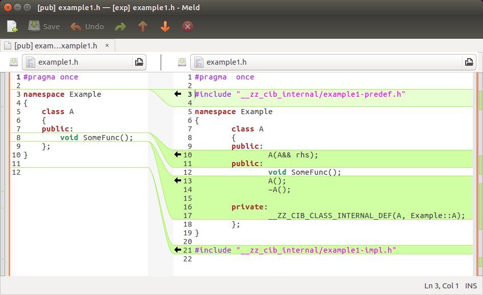
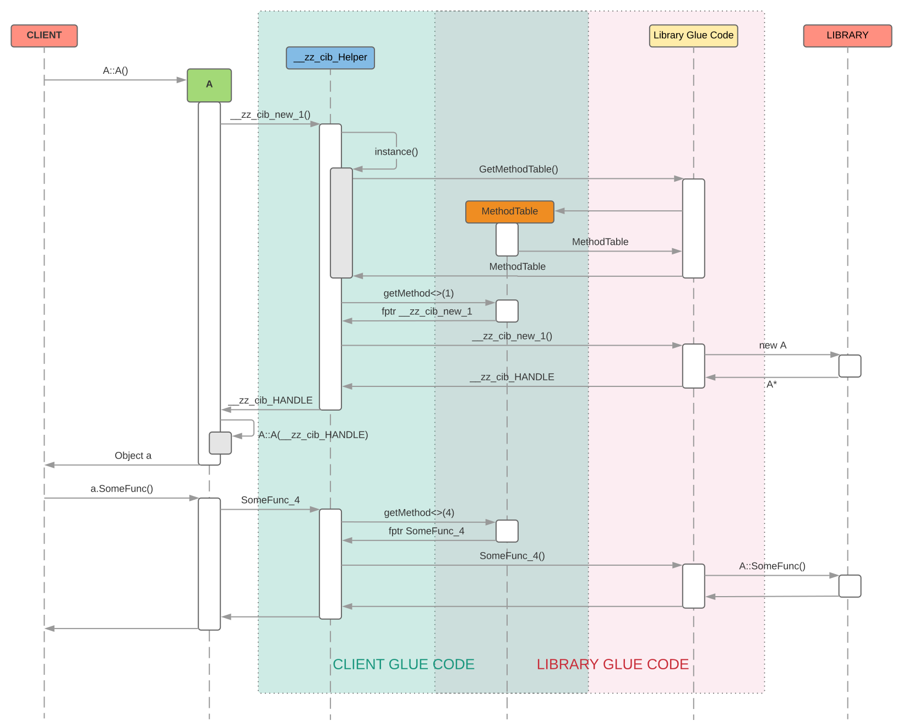

Component Interface Binder (CIB)
================================

# CIB

**In a nutshell CIB is the answer to the problem for which C is used for exporting APIs of an application/library even when the application/library itself uses C++ for most of its implementation. C++ is great in expressing API but compiler generated ABI makes it difficult to use to publish compiler independent and forward compatible SDK.**

## Abstract
*Because there is no way for C++ to be ABI compatible programmers use C for exporting APIs that can be called from across a DLL boundary.  
There are some proposals about standard C++ ABI, like [Itanium C++ ABI](http://mentorembedded.github.io/cxx-abi/), that if used by all compilers and that does not change based on compiler switch, will make it possible, at-least in theory, to use C++ for exporting APIs.  
But even if that becomes reality using C++ as SDK will still be difficult. A C++ class definition also contains private methods and data members which a programmer may not want its client to see. So, a C++ programmer will have to use a design pattern like [bridge](en.wikipedia.org/wiki/Bridge_pattern) or segregation of interface and implementation as used in COM. There will be other problems too, like some changes in libray can make client program incompatible, forward and backward compatibility are something that will not be supported by just being ABI compatible.
CIB solves the incompatible ABI problem, makes component resilient against non-breaking changes, and supports forward and backward compatibility. CIB supports all these without enforcing use of any particular design pattern or new way of writing program. CIB does not use low level compiler tricks, it does not try to exploit how any compiler implements C++ language feature. Basically CIB uses plain basic C/C++ to provide all its functionality.*

## Overview
CIB is an automated way to generate code that allows one binary component to use classes and functions defined in another binary component that may be built using different compiler.
For example it can be used by an application program to export C++ SDK which can be used to write plugins of the application. And plugin writers don't need to use exactly same compiler that was used to build the application. Since ABI compatibility cannot be guaranteed by C++ compilers, we can use CIB to publish C++ DLL or C++ SDK of an application.

*In this document the binary component that exposes its classes will be called Library, a library can be an executable or a DLL. The component that uses SDK of the library will be called client of that library.*

## CIB Features:
  - Clients don't need to recompile just because library headers are modified unless the signature of API (methods and functions) used by client is changed.
  - Clients of library will keep working, without recompiling, with new version of library.
  - Functions, methods (including virtual methods) can be reordered in library code and client will keep working without recompiling with new headers. **This feature of CIB makes it superior to any other solution we know.**
  - Clients can use library provided classes without linking with the library at compile time.
  - Clients will not need recompiling when there is minor change in class inheritance. For example if in one version of library class B was derived from A and in next version class B is derived by both A and C then such change will not enforce client to recompile and clients compiled with previous version of headers will keep working with new version of library. **This too is something that no ABI compatible standard will be able to support.**

 **Some of these features are provided by COM. But CIB has other advantages over COM.**

  - Clients can define new classes by deriving from concrete classes provided by library (*note that it is made possible even when complete class definition is not available to client*).
  - No need to write interface definition files (.idl/.odl files).
  - No need to maintain order of virtual functions across releases.
  - No need to maintain order of data members of structs.
  - No need to have a size member in struct. *This is a big hack almost all C/C++ library uses*.
  - No need to declare all functions as pure virtual. CIB allows a class to export all kind of methods like static, virtual, pure virtual, inline etc. Only thing is that an inline function will not remain inline if invoked by the client.
  - CIB, unlike COM, works on all platforms.

 **CIB allows client of a library to use all exported classes as if those classes are part of the client code itself without exposing the internals of classes.**

## CIB Goals
 - To become an easier and superior alternative of COM in-proc used.
 - To work on all platforms without any gotcha.
 - Client that is written using traditional linking with library can easily migrate to **CIB**. This requires that CIB should be designed in such a way that it should not have any footprint in the code of client as well as library. There will ofcourse be a small boiler plate code on both side but that's about it, the rest of the code will remain aloof about existence of CIB.

## CIB Stretch goals (may be future goals)
 - To become an easier and superior alternative of out-proc COM.
 - To become an easier and superior alternative of DCOM.

## Other Solutions
I have come across some solutions that try to solve the same problem but none of them is good enough. Some wants you to write separate layer on top of existing classes so that vtable is exported across dll boundary in a portable manner or some exploits how compiler behaves and uses hacks to achieve goals or some is too specific to the project it was developed for.

 - **CppComponent**: It basically uses hand written vtable to solve ABI problem. It looks like a clone of COM without idl. More details can be found here: https://github.com/jbandela/cppcomponents.
 - **DynObj**: It exploits how compiler implements vtable. For details here: http://dynobj.sourceforge.net.
 - **Libcef's translator**: Its a python script that parses C++ headers to produce automatic C layer for client and library. But it is too much specific to libcef and cannot be used in other project.
 
 **And none of these solutions I am aware of are resilient against unimportant changes that library can do which should not but unfortunately they do affect client programs. _Unimportant changes are described later_. **

## CIB Architecture
**Or rather the architecture CIB produces for integration of library and it's client**


**CIB achieves all its functionalities by using few simple design rules:**

1. CIB produces glue code for both library and clients.
2. Library side glue code converts C++ objects into C objects.
3. Client side glue code converts C objects into C++ objects.
4. Only PODs cross DLL boundary.
5. All function calls between two CIB layers (i.e. library glue code and client glue code) use calling convention that is supported by all compilers, e.g. **__stdcall** convention for x86 architecture.
6. Pointer of an object belonging to one binary component is never dereferenced by another and they are only treated as opaque objects.
7. Virtual function table of one component is not directly accessed by another component.
8. CIB generates table of functions called MethodTable that are independent of compiler and remain binary compatible because new functions are only added at the end and removal of function does not affect other functions.

**Note that all these restriction are not imposed on library/client developers. The CIB layer, which is automatically generated, takes care of all these rules.**

All in all `cib` avoids sharing of compiler generated stuffs across component boundary. Below are the list of compiler generated stuff that can cause problem:
1. Mangled function name.
2. Virtual function table.
3. Object layout.
4. Underlying integer type of `enum`.
5. Funnction calling mechanism which is affected by function calling convention. For this problem `cib` just uses same calling convention for both library and clients.

## How CIB works
 Following are the broad things that CIB does:

  - CIB parses all public C/C++ header files of library and creates two sets of files.
  - One set of files should be compiled with the library. We will call it library side glue code
  - The other set should be used by the client of the library. This is client side glue code.
  - Library side glue code defines raw C APIs for all functions including class methods, constructors, and destructors.
  - Implementation of such C APIs are just to delegate the call to original function/method/constructor/destructor/etc.
  - All C APIs are assigned an integer value as its ID. This ID for an API will remain same across releases.
  - For every class/struct/union/namespace a **MethodTable** is defined which is an array of function pointers.
  - Library side glue code exports a C function that returns **MethodTable** for given class/struct/union/namespace ID.
  - Class definitions for client is generated with same class-name but without any data member other than an opaque pointer to original class defined by library. In *CIB terminology* classes that are seen by client are called **proxy-classes** and the opaque pointer held by proxy-class is called **handle**. This is basically pimpl pattern with pimpl pointing to object across DLL boundary.
  - Function ID is used as an index to fetch function pointer from **MethodTable**.
  - Implementation of all functions including class methods, constructors, and destructors for classes at client side are provided by means of invoking function pointer.

## Non breaking changes
  Some changes are conceptually unimportant for clients of a library but they can break binary compatiblity of library and client. CIB makes client resilient against such changes and so client remain binary compatible with library even when such changes are made. Below are such changes that client built with SDK generated by CIB are resilient against:
- Any change in internal data member of a class.
- Change in order of virtual functions of a class.
- Change in inheritance that doesn't violate previous is-a relationship. For example if a class starts deriving from one more base class without removing previous base class then client will remain binary compatible because the is-a relation client is aware of hasn't changed. Similarly if a class changes it's base class to another derived class of it's previous base class then also client will remain binary compatible because of same reason that previous is-a relation is still intact.
- Change in `inline`ness of a function. For CIB generated SDKs all inline functions are basically non-inlined and so it doesn't make any difference if `inline`ness of a function is changed.


### Example
For working example see projects **shape** and **draw** in test folders.

**shape** is the library that provides definition of various shape classes, like Circle, Rectangle, etc.  
**draw** is the client of **shape** that uses it to draw various shapes inside a window.  
Folder **shape/pub** contains files that shape library wants to make public.

When **cib.exe** is run as pre-build steps of **shape** project it creates files in **shape/cib** and **shape/exp**. These generated files uses files in **shape/pub** as input.   
Files in **shape/cib** are meant for **shape** library to compile with it.  
Files in **shape/exp** are meant for **draw** project to compile.

Look at files in **shape/cib** and **shape/exp** folders to know how exactly **CIB** makes it possible to use C++ as an interface between two binary components even when C++ comes with inherent ABI incompatibility problem.

## Building CIB
To build CIB you need to pull **common**, **cppparser**, and **cib** source code in such a way that you get folders with these names in same parent folder. Basically you need to run git clone in same folder for all these projects.

## Feature Progress


| Feature                           | Description                                                                                                                                                                                                                                                                                                                                          | Status |
| --------------------------------- | :--------------------------------------------------------------------------------------------------------------------------------------------------------------------------------------------------------------------------------------------------------------------------------------------------------------------------------------------------- | :----- |
| Basic                             | CIB should work for a simple library that exports some classes with virtual functions.                                                                                                                                                                                                                                                               | Done   |
| Function overloading              | Same named functions of a class should be seamlessly exported.                                                                                                                                                                                                                                                                                       | Done   |
| Function overridding              | Allow library to use interface implemented by client.                                                                                                                                                                                                                                                                                                | Done   |
| Forward compatibility of client   | Client program built using previous version of SDK works flawlessly with newer library even when virtual table is disrupted or some other unimportant changes are done in library.                                                                                                                                                                   | Done   |
| Forward compatibility of library  | Library should be forward compatible with client built with newer version of SDK. Of course client program will not be able to invoke functions available in newer SDK when run with older library and so client should be written with backward compatibility in mind.                                                                              | Done   |
| Backward compatibility of client  | When client, built with newer SDK, invokes a method (present only in new SDK) but library which is of older version and doesn't have implementation of that method then std::bad\_function\_call exception will be thrown. Clients that want to be backward compatible should handle this exception when invoking methods present only in newer SDK. | Done   |
| Backward compatibility of library | When library invokes a method of interface implemented by client which is built with older SDK that didn't have new method then std::bad\_function\_call exception will be thrown. Library developer should be aware about this to remain backward compatible when invoking new methods of it's own public interface.                                | Done   |
| Create correct proxy class        | A base class pointer returned by an API of library may actually be pointing to an object of a derived class. At client side we should create proxy class of exact same type to which the returned pointer is pointing to. It is needed so that dynamic_cast at client side should work as expected.                                                  | Done   |
| Operator overloading              | It is common for C++ classes to have overloaded operators.                                                                                                                                                                                                                                                                                           | Done   |
| Return existing proxy class       | If a function returns pointer or reference of object for which proxy class already exists then existing proxy class should be returned.                                                                                                                                                                                                              |
| Rvalue reference parameter        | RValue references need to cross DLL boundary.                                                                                                                                                                                                                                                                                                        |
| Enum and enum classes             | Enums used as parameter or return type.                                                                                                                                                                                                                                                                                                              |
| STL classes                       | It is common for a C++ programs to use stl classes. CIB should make it possible to export STL classes in the same way it does for every other classes.                                                                                                                                                                                               |
| Exception support                 | Make exception object travel across DLL boundary in a compatible way.                                                                                                                                                                                                                                                                                |
| Support for intrusive pointer     | Many libraries use intrusive pointer to manage object life cyle and functions can return smart pointer for intrusively managed reference count of object.                                                                                                                                                                                            |
| Support shared_ptr and unique_ptr | Modern C++ programing expects these to be used more often.                                                                                                                                                                                                                                                                                           |
| Support struct                    | Automatically add getter/setter for public data members.                                                                                                                                                                                                                                                                                             |
| Support struct in a better way    | Add smart objects as data members in proxy classes so that user does not need to explicitly call getter and setter for public data members defined in class/struct exported by library. Instead, user can write code as if the structs are locally defined.                                                                                          |

---

## CIB Terminology
### Proxy Class
For each public class of a library CIB produces another class with same name and methods but with small changes so that `cib` can do it's job that it promises to do. Such client usable classes are called proxy classes because they act as a proxy of original class to the client.
### Handle
Each proxy class instance owns opaque pointer of the original class. Such opaque pointer are called handle.
### Shared Class
A C++ class that crosses component boundary: if there exists a public function that returns an object/pointer/reference of a C++ class or takes object/reference/pointer as parameter then such class is called a shared class.
### Facade Class
A C++ class that has public virtual method and there exists public function/method that returns a pointer/reference of this class.
### Interface Class
A C++ class that has public virtual method and there exists a way for library to call methods of an object of class defined by client.
A simplest example can be that when a C++ class that has public virtual method and there is a function that accepts pointer/reference of that class as parameter.

## Running CIB
CIB is expected to be run with public headers that a library wants to publish.
Below is the example of running cib:

```shell
cib -i pub/ -o exp/ -b cib/ -m Example
```

Assuming `pub/` is the folder that contains public headers that library wants to publish. `exp/` is the folder where cib creates headers (and also some source files) that forms the part of published SDK. `cib/` is the folder where cib creates glue code for library. Library is expected to compile these sources as part of itself. `Example` is the name of the module (or library). It is a mandatory command line argument required by cib to define glue code.

## Disection of CIB generated code
For better understanding of what CIB does we will consider examples to see what will happen if we want to publish SDK using CIB. We will start with trivial example and slowly build on that to understand what `cib` will do in more complex cases. The code generated by `cib` is solely for compiler. Developers (of both library and client) don't even need to look into most part of generated code. But we will look into generated code to understand internal working of `cib`.

Before we delve into code emitted by `cib` let's look at some of the fundamental types and definitions `cib` uses in generated code.

### Method Table

`cib`'s basic functioning is that it doesn't let compiler generated stuff cross component boundary. Compiler generates many things and among them are mangled function name and virtual tables. `cib` bypasses the use of mangled function name and virtual table by having it's own table of functions that in cib's terminology is called method table. So, `cib` uses mechanism to use method table instead of mangled function name and virtual function table. So, let's look at what this method table is exactly:

**Method table and helper function**:
```c++
namespace __zz_cib_ {

//! Contains information about method table.
struct __zz_cib_MethodTableHeader
{
  std::uint32_t size;       //!< sizeof(__zz_cib_MethodTableHeader)
  std::uint32_t numMethods; //!< Number of methods in method table.
};

//! Generic type for function pointer.
using __zz_cib_MethodEntry = void (*)();

//! Method table which is array of __zz_cib_MethodEntry.
//! @note The very first element in the table must be a
//! pointer to __zz_cib_MethodTableHeader.
using __zz_cib_MethodTable = const __zz_cib_MethodEntry*;

//! Fetches method from a method table
//! @param mtbl Method table from which to fetch the method.
//! @param slot Index at which to fetch method from.
//! @return __zz_cib_MethodEntry value which is guarenteed to be non-null.
//! @note Will throw std::bad_function_call() if method table doesn't contain
//! method or the fetched method is null.
inline __zz_cib_MethodEntry __zz_cib_GetMethodEntry(__zz_cib_MethodTable mtbl,
                                                    std::uint32_t        slot)
{
  assert(slot > 0);
  auto mtblHeader =
    reinterpret_cast<const __zz_cib_MethodTableHeader*>(mtbl[0]);
  if ((slot > mtblHeader->numMethods) || (mtbl[slot] == nullptr))
    throw std::bad_function_call();

  return mtbl[slot];
}

} // namespace __zz_cib_
```

Above we have definition of method table and helper function to fetch method from method-table. So, basically method table is an array of function pointers. This is the table that crosses component boundary instead of mangled function name or virtual table. We will see how but as of now it is enough to know what exactly is method table.

**Macro for export function attribute**:

```c++
//! @def __zz_cib_export
//! Function attribute that makes symbol externally visible
#ifdef __zz_cib_export
#  undef __zz_cib_export
#endif

#if defined _WIN32 || defined __CYGWIN__
#  ifdef __GNUC__
#    define __zz_cib_export __attribute__((dllexport))
#  else
#    define __zz_cib_export __declspec(dllexport)
#  endif
#else
#  if __GNUC__ >= 4
#    define __zz_cib_export __attribute__((visibility("default")))
#  else
#    define __zz_cib_export
#  endif
#endif
```

We will see `__zz_cib_export` used exactly once in generated code and that too in library glue code. That will tell us that the function for which it is used is the only function that will cross component boundary with it's name. All other funtions cross component boundary only as function pointer. Since an exported funtion needs to be called by client there has to be a macro for import attribute of function. So, let's see that:

**Macro for import function attribute**:

```c++
//! @def __zz_cib_import
//! Function attribute that makes external symbol accessible
#ifdef __zz_cib_import
#  undef __zz_cib_import
#endif

#if defined _WIN32 || defined __CYGWIN__
#  ifdef __GNUC__
#    define __zz_cib_import __attribute__((dllimport))
#  else
#    define __zz_cib_import __declspec(dllimport)
#  endif
#else
#  if __GNUC__ >= 4
#    define __zz_cib_import __attribute__((visibility("default")))
#  else
#    define __zz_cib_import
#  endif
#endif
```

Like `__zz_cib_export` we will see `__zz_cib_import` used exactly once in generated code for client. That will tell us that the function for which it is used is the only function that will be imported with it's name. All other functions of library will be used by client only as function pointer.

**Macro to define calling convention**:

```c++
//! @def __zz_cib_decl
//! Calling convention to be used for functions
//! called from across component boundary
#ifdef __zz_cib_decl
#  undef __zz_cib_decl
#endif

#ifdef __GNUC__
#  define __zz_cib_decl __attribute__((stdcall))
#elif defined(_WIN32)
#  define __zz_cib_decl __stdcall
#endif
```

When we see `__zz_cib_decl` in generated code it is safe to ignore them for most cases. It is there only to ascertain that compilers of both library and client use same calling convention for all functions that are called from across component boundary. Ignoring them helps unclutter the complex looking code.

**Type definiton of opaque pointers used by client and library**:

```c++
namespace __zz_cib_ {

//! Objects of classes defined by library travels to client as handles.
//! Only object pointers travel across component boundary and objects of library
//! go to client as opaque pointer of __zz_cib_HANDLE.
class __zz_cib_HANDLE;

} // namespace __zz_cib_

namespace __zz_cib_ {

//! Objects of classes defined by client travels to library as proxies.
//! Only object pointers travel across component boundary and objects of client
//! go to library as opaque pointer of __zz_cib_PROXY.
class __zz_cib_PROXY;

} // namespace __zz_cib_
```

As I have mentioned earlier that `cib` doesn't let compiler genearted stuff to cross component boundary. Among those stuff is object layout too. `cib` uses opaque pointer for objects belonging to other component and completely avoids accessing compiler generated object layout of another component. For this purpose `cib` defines `__zz_cib_HANDLE` and `__zz_cib_PROXY` to represent library side and client side objects to vice versa in opaque manner.

**Helper class**

```c++
namespace __zz_cib_ {

//! Base class for helper class of proxy classes.
//! It only facilitates in dealing with method table.
class __zz_cib_Helper
{
protected:
  __zz_cib_Helper(__zz_cib_MethodTable _mtbl)
    : mtbl(_mtbl)
  {
  }

  //! Utility method to get method from method table.
  //! @param methodId ID for which method has to be fetched.
  //! @return Method of type specified as template parameter.
  template <typename _MethodType>
  _MethodType getMethod(std::uint32_t methodId) const
  {
    return reinterpret_cast<_MethodType>(__zz_cib_GetMethodEntry(mtbl, methodId));
  }

private:
  __zz_cib_MethodTable mtbl;
};

} // namespace __zz_cib_
```

`class __zz_cib_Helper` is used as base class of all helper classes. We will know about that in more detail but as of now we should just know that this class provides a helper method to fetch function pointer of supplied type from method table.

Armed with the knowledge of these fundamental types that `cib` uses we are now ready to dive into more details of generated code.

### Example-1: A Simple Class
To begin with we will consider following example:

**File: example1.h**:
```c++
#pragma once

namespace Example
{
    class A
    {
    public:
        void SomeFunc();
    };
}
```

Assuming this file is in folder `pub/` we can run `cib` as shown below:

```shell
cib -i pub/ -o exp/ -b cib/ -m Example
```

After above command we will see quite a good number of files created in folder cib/ and exp/.
These generated code are only for compiler to see and developers don't need to know them, except for files directly present in exp/ folder. But to understand what `cib` does we will go into the details anyway.  Broadly there will be 2 sets of files. One set is for library that it will have to compile when it builds itself and other set is for client of the library to use.
Undoudtedly in this example we have a vividly simple class, but we do see lots of code getting generated. These codes are required for `cib` to guarentee compiler independence and forward compatibility. They are not complex but there are few pieces that we will look closer. Please brace yourself for a deep dive. :)

#### Unique IDs for all entities.
First of all unique IDs will be assigned to all entities (e.g. classes and methods). `cib` creates a separate file that is just for IDs. The file that defines IDs is the only file that is shared by both library and client glue code. One copy of this file can be found in cib/ folder.

**File: __zz_cib_Example-ids.h**:

```c++
// DO NOT EDIT THIS FILE

#pragma once

namespace __zz_cib_ { namespace __zz_cib_classid {
	enum {
		//#= ::Example::A
		__Example__A = 1,
		__zz_cib_next_class_id = 2
	};
}}

namespace __zz_cib_ { namespace Example { namespace A { namespace __zz_cib_methodid {
	enum {
		//#= void SomeFunc();
		SomeFunc_1 = 1,
		//#= A();
		__zz_cib_new_2 = 2,
		//#= ~A()
		__zz_cib_delete_3 = 3,
		__zz_cib_next_method_id = 4
	};
}}}}
```

Every entity is given a unique integer ID. These integer values remain same irrespective of changes in the public headers. `cib` reads these generated IDs in subsequennt runs and keeps the value unchanged while generating the IDs again in next run. For allowing cib to keep the value unchanged `-c` or `--cib-ids-file` option should be used to pass the file-name of previously generated id-file to `cib`.
There are few points to note about this id file:

1. There is always a top level namespace with name `__zz_cib_`. It is there to not pollute global namespace. The name `__zz_cib_` was chosen so that:

      - It doesn't clash with any possible name used in library.
      - Since the name starts with double underscore it is expected that developers will stay away from directly using it.
      - In an ordered listing of symbols `__zz_cib_` should appear towards the end and so intellisense suggestions of IDE will possibly not contain it before some more meaningful symbols.

2. There are namespaces with same name as class name (e.g. for class A there is a namespace A). That's the way `cib` arranges IDs of entities. Going forward we will see lots of uses of namespace in code generated by `cib`.
3. For all IDs there is a comment starting with `//#=`. It is meant for next run of `cib` which uses these comments to identify previously assigned IDs to entities. So, in the next run if the path of the ID file is provided to `cib` it will ensure that IDs of entities don't change. **This is very important part of `cib` that guaratees forward compatibility of C++ componenets.**
4. ID names corresponding to methods end with an integer. It is for ensuring unique name for overloaded methods.
5. ID names are created for constructor and destructors even when they were not present in original class definition. We will shortly know why.
6. ID name for constructor starts with `__zz_cib_new`. It is the name `cib` gives to constructors.
7. There are some more symbols like `__zz_cib_next_class_id` and `__zz_cib_next_method_id`. They are for `cib` to know what IDs to use for next entity.

#### Library Glue Code
`cib` will generate library glue code and library is expected to compile these source code while building itself. The aim here for `cib` is to generate compiler independent and forward compatible glue code. So, for the `class A` of example-1 following will be the generated library glue code:

**File: example1.h.cpp**:

```c++
#include "__zz_cib_Example-ids.h"
#include "__zz_cib_Example.h"
#include "example1.h"

namespace __zz_cib_ { namespace Example { namespace A {
	static void __zz_cib_decl SomeFunc_1(::Example::A* __zz_cib_obj) {
		__zz_cib_obj->::Example::A::SomeFunc();
	}
	static ::Example::A* __zz_cib_decl __zz_cib_new_2() {
		return new ::Example::A();
	}
	static void __zz_cib_decl __zz_cib_delete_3(::Example::A* __zz_cib_obj) {
		delete __zz_cib_obj;
	}
}}}

namespace __zz_cib_ { namespace Example { namespace A {
	__zz_cib_MethodTable __zz_cib_GetMethodTable() {
		static const __zz_cib_MethodTableHeader tableHeader = { sizeof(__zz_cib_MethodTableHeader), 3 };
		static const __zz_cib_MethodEntry methodTable[] = {
			reinterpret_cast<__zz_cib_MethodEntry> (&tableHeader),
			reinterpret_cast<__zz_cib_MethodEntry> (&SomeFunc_1),
			reinterpret_cast<__zz_cib_MethodEntry> (&__zz_cib_new_2),
			reinterpret_cast<__zz_cib_MethodEntry> (&__zz_cib_delete_3)
		};
		return methodTable;
	}
}}}
```

As mentioned earlier `cib` uses namespace in plenty to isolate it's generated code from main code and also to avoid any possible name clashes.
There are mainly 2 parts in this file. In the first part we see plain C-style static functions that are implemented by just delegating to C++ methods. For example function `SomeFunc_1` is implemented by calling `::Example::A::SomeFunc()`. Similarly there are functions for constructor and destructor too and they call `new` and `delete`.
The second part of this file defines a function `__zz_cib_GetMethodTable`.
The implementation of `__zz_cib_GetMethodTable` is to return a static table of methods. We will later see how this method table is used by the client side glue code to implement classes that client would use but I want to make a point here that `cib` guarentees that the items in the table will not be shuffled around when `cib` is run again. **That's the backbone of how `cib` guarentees forward compatibility.** So, even when new methods are added to `class A` the new items in the method table will only get added at the end irrespective of where the new method is added in the class. So, older client of library that were compiled with older SDK will continue working with new library if no existing methods are removed.

#### Library Gateway function

**File: __zz_cib_Example.cpp**:

```c++
#include "__zz_cib_Example.h"
#include "__zz_cib_Example-ids.h"

namespace __zz_cib_ { namespace Example { namespace A { __zz_cib_MethodTable __zz_cib_GetMethodTable(); }}}

extern "C" __zz_cib_export __zz_cib_::__zz_cib_MethodTable __zz_cib_Example_GetMethodTable(std::uint32_t classId)
{
	switch(classId) {
	case __zz_cib_::__zz_cib_classid::__Example__A:
		return __zz_cib_::Example::A::__zz_cib_GetMethodTable();
	default:
		return nullptr;
	}
}
```

We see implementation of function `__zz_cib_Example_GetMethodTable`. *`Example` in name is because it is the name of module supplied as value of `-m` command line parameter*. This function is like gateway for client to access all functionality of the library. This function returns the method table for a given class-id. In previous section we had already seen implementation of `__zz_cib_GetMethodTable` for classes which is called from here. Since our trivial example had just one class there is just one `case` statement, had there been more classes there would have been more case statements. In later examples we will see those cases as well.

Now we will visit code that will be part of SDK and will be used by clients.

#### Import of library gateway function
Let's begin to look at client side with the part that imports library gateway function.

```c++
extern "C" __zz_cib_import __zz_cib_::__zz_cib_MethodTable __zz_cib_Graphics_GetMethodTable(std::uint32_t classId);
```

As you can see it is counter part of what library code defined which had used `__zz_cib_export` instead of `__zz_cib_import`. With this declaration client code gets access to `__zz_cib_Example_GetMethodTable` and we will shortly see use of this below.

#### SDK Headers and Proxy Classes
Now we will look into the headers that will be used by client developer. This is the only part of generated code that is meant to be seen by developers and so `cib` tries to keep this as close to original as possible. Below is the header for  `class A` that `cib` produced from the header library developer wished to publish.

**File: example1.h**:

```c++
#pragma once

#include "__zz_cib_internal/example1-predef.h"

namespace Example
{
	class A
	{
	public:
		A(A&& rhs);
	public:
		void SomeFunc();
		A();
		~A();

	private:
		__ZZ_CIB_CLASS_INTERNAL_DEF(A, Example::A);
	};
}

#include "__zz_cib_internal/example1-impl.h"
```

You can notice certain differences between this class and the original class in folder pub/. Below is the screenshot of a diff application that makes the differences clear:



We can see that the header is *almost* same as original, except some "hook points" that `cib` inserted. There is one file inclusion in the beginning and one at the end. Class definition is same functionality wise. `cib` added *missing* default constructor, destructor and also a move constructor. A macro `__ZZ_CIB_CLASS_INTERNAL_DEF` is also inserted in private section of the class. *The `private:` before __ZZ_CIB_CLASS_INTERNAL_DEF is a lie, we will later see why.* These extra insertions in the header certainly makes the header a bit ugly but they are worth the price because they add lots of value which were simply not present earlier. 

Now, let's have a look at the `predef` file that is `#include`d in the beginning.

**File: __zz_cib_internal/example1-predef.h**:

```c++
#include "__zz_cib_internal/__zz_cib_Example-def.h"

namespace __zz_cib_ { namespace Example { namespace A {
	class __zz_cib_Helper;
}}}
```

We see a forward declaration of `class __zz_cib_Helper`. Helper class is the one that will do most of the heavy lifting. It is there to take away all the dirty details and keep the client facing header clean. We will look into that in next part. Let's see what is the definition of that macro `__ZZ_CIB_CLASS_INTERNAL_DEF` that is present inside the class.

**File: __zz_cib_internal/__zz_cib_Example-class-internal-def.h**:

```c++
//! @def __ZZ_CIB_CLASS_INTERNAL_DEF
//! Macro that allows cib to add it's hook in proxy classes in a minimally
//! invasive way.
#define __ZZ_CIB_CLASS_INTERNAL_DEF(className, fullName)                                                               \
protected:                                                                                                             \
  className(__zz_cib_::__zz_cib_HANDLE* h);                                                                            \
                                                                                                                       \
private:                                                                                                               \
  friend class __zz_cib_::fullName::__zz_cib_Helper;                                                                   \
  __zz_cib_::__zz_cib_HANDLE* __zz_cib_h_
```

Macro `__ZZ_CIB_CLASS_INTERNAL_DEF` adds a protected constructor, declares `__zz_cib_Helper` as a friend class and adds a private data member. The data member `__zz_cib_h_` is the opaque pointer of original class that is created on library side. The constructor is to construct object from opaque pointer. We call client facing class as proxy class because the "real" object is on the library side and the proxy class only holds an opaque pointer of that.It's time to see the implementation of the methods of proxy class.

**Implementation of methods of proxy class**:

```c++
inline Example::A::A(__zz_cib_::__zz_cib_HANDLE* h)
	: __zz_cib_h_(h)
{}

inline Example::A::A(A&& rhs)
	: __zz_cib_h_(rhs.__zz_cib_h_)
{
	rhs.__zz_cib_h_ = nullptr;
}

inline void Example::A::SomeFunc() {
	__zz_cib_::Example::A::__zz_cib_Helper::SomeFunc_1(__zz_cib_h_);
}

inline Example::A::A()
	: A(__zz_cib_::Example::A::__zz_cib_Helper::__zz_cib_new_2())
{}

inline Example::A::~A() {
	auto h = __zz_cib_::Example::A::__zz_cib_Helper::__zz_cib_release_handle(this);
	__zz_cib_::Example::A::__zz_cib_Helper::__zz_cib_delete_3(h);
}
```

First two are easy, one constructs object from handle (i.e. opaque pointer) and another is a move constructor. Implementation of next three are mostly about delegating to methods of `__zz_cib_Helper`. But implementation of constructor `A::A()` is slightly different. This constructor calls `__zz_cib_Helper::__zz_cib_new_2` and passes the returned value to another constructor. Basically `__zz_cib_Helper::__zz_cib_new_2` returns a handle and then the very first constructor is used to construct object from handle. Now we will look at definition of `__zz_cib_Helper` which actually contains most of the implementation.

**class __zz_cib_Helper definition**:

```c++
namespace __zz_cib_ { namespace Example { namespace A {
	class __zz_cib_Helper : public __zz_cib_::__zz_cib_Helper {
	private:
		friend class ::Example::A;

		static void SomeFunc_1(__zz_cib_HANDLE* __zz_cib_obj) {
			using SomeFuncProc = void (__zz_cib_decl *) (__zz_cib_HANDLE*);
			auto method = instance().getMethod<SomeFuncProc>(__zz_cib_::Example::A::__zz_cib_methodid::SomeFunc_1);
			return method(__zz_cib_obj);
		}
		static __zz_cib_HANDLE* __zz_cib_new_2() {
			using __zz_cib_newProc = __zz_cib_HANDLE* (__zz_cib_decl *) ();
			auto method = instance().getMethod<__zz_cib_newProc>(__zz_cib_::Example::A::__zz_cib_methodid::__zz_cib_new_2);
			return method();
		}
		static void __zz_cib_delete_3(__zz_cib_HANDLE* __zz_cib_obj) {
			if (__zz_cib_obj) {
				using __zz_cib_deleteProc = void (__zz_cib_decl *) (__zz_cib_HANDLE*);
				auto method = instance().getMethod<__zz_cib_deleteProc>(__zz_cib_::Example::A::__zz_cib_methodid::__zz_cib_delete_3);
				return method(__zz_cib_obj);
			}
		}
		__zz_cib_Helper()
			: __zz_cib_::__zz_cib_Helper(
				__zz_cib_Example_GetMethodTable(
					__zz_cib_::__zz_cib_classid::__Example__A)) {}
		static const __zz_cib_Helper& instance() {
			static __zz_cib_Helper helper;
			return helper;
		}
	... skipped some lines as they are not relevant for current discussion ...
	};
}}}
```

We see that class `__zz_cib_::Example::A::__zz_cib_Helper` is derived from `__zz_cib_::__zz_cib_Helper`. We had already seen this base class earlier which defines a helper method to fetch methods.
If we look at the definition of constructor we see that a call to `__zz_cib_Example_GetMethodTable` is made and returned value is passed to base class connstructor. The implementation of other methods are done by delegating calls to function whose pointer is fetched using `getMethod<>()`. One more thing to notice is that class `__zz_cib_::Example::A::__zz_cib_Helper` is a singleton and so only the very first time method table is fetched from library and then the same object is used for subsequent calls.
Let's see what happens when following code is executed by client program:

**Code Sample-1**

```c++
int main()
{
	Example::A a;
	a.SomeFunc();
}
```

Below is the call sequence diagram for this sample:


As mentioned before, no compiler generated stuff are shared between components, and we can see method-table generated by `cib` is the only thing that are shared by `library` and `client`.
This sequence diagram doesn't mention destrutor because I didn't want to make it look complicated. Destructor will have similar call sequence like other methods.

This ends the explanation of our first example I hope the basics of how `cib` works should now be clear. We will now move on to next example to see what happens to classes with virtual methods.

## Implementation Details
### Parsing Technique
We use cppparser to parse C++ headers. Clang can be an option but since we do not need full and complete compiler level type resolution clang is not suitable for us. For example if a function is declared as:

`
void ExampleFunction(wxInt32 i);
`

cib doesn't need to resolve wxInt32. In-fact if it resolves it completely then it will be a problem because wxInt32 can be an **int**, or a **long** depending upon platform and cib really should produce same definitions on all platforms. The idea of cib is that it should produce same headers for all platforms so that it can be used to publish SDK because different headers for different platforms don't sound like a good idea.

### Creating proxy class from handle
When a function returns pointer to base class then it is necessary to create instance of proxy class which represents exact same class that the returned pointer is pointing to. For example if a function return type is Shape* and when invoked it actually returns pointer to a Rectangle instance. On client side we will need to create instance of Rectangle proxy class instead of Shape proxy class. It is to be noted that it has to be done only for facade classes for other classes there is no need for this.
