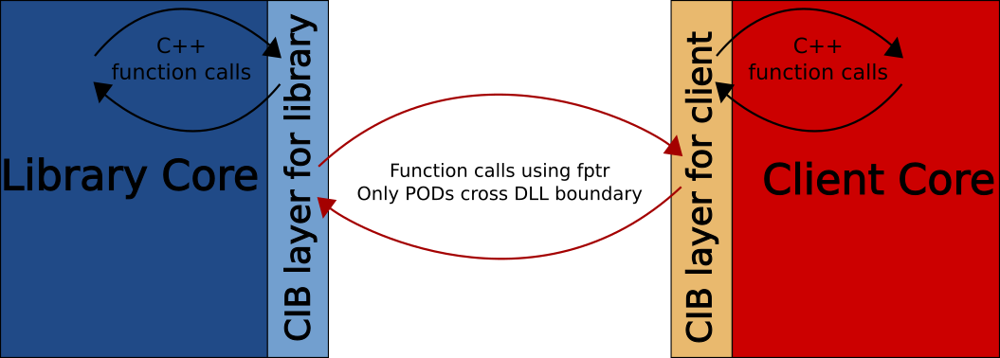

Component Interface Binder (CIB)
================================

[](https://codecov.io/gh/satya-das/cib)
[](https://www.codacy.com/gh/satya-das/cib/dashboard?utm_source=github.com&amp;utm_medium=referral&amp;utm_content=satya-das/cib&amp;utm_campaign=Badge_Grade)
[](https://opensource.org/licenses/MIT)

| Platform | CI Status                                                                                                                                  |
| -------- | :----------------------------------------------------------------------------------------------------------------------------------------- |
| OSX      | [](https://travis-ci.com/github/satya-das/cib)     |
| Linux    | [](https://travis-ci.com/github/satya-das/cib) |

# CIB

**CIB is an architecture to publish compiler independent and ABI stable C++ SDK**

It can be said that CIB architecture is an [hourglass design pattern](https://www.slideshare.net/StefanusDuToit/cpp-con-2014-hourglass-interfaces-for-c-apis) on steroid.

## Jargon
1. **ABI Compatibility**: Compatibility of binary C++ components even when they are built with different compilers.
2. **ABI Stability**: Ability of a binary component to work with newer version of another component without recompiling. Example of ABI stability is the ability of a plugin (in binary form) of an application to seemlessly work with newer application.
3. **Forward Compatibility**: It is a specific case of ABI stability where older library can work with newer client.
4. **Backward Compatibility**: It is a specific case of ABI stability where newer library can work with older client.

In this document when _ABI Stability_ is mentioned we will mean both forward and backward compatibility.

# Overview
CIB is an architecture to publish compiler independent and ABI stable C++ library.
This project is also about a tool that implements `cib architecture` automatically for given library headers.
CIB can also be used as a plugin architecture for an application.
One of the goal of CIB is to have minimum footprint, i.e. it should not change the way how developers write their program.

# Why C++ has ABI stability issues
Actually even C has this problem, C++ has more features and so it is more difficult to achieve it with C++.
Things that can cause ABI compatibility and stability issues in C++ are:
1. Object layout.
2. Function calling convention.
3. Allocators and deallocators.
4. Underlying integer size of `enum`.
5. Size of various integer types.
6. Mangled function name.
7. Virtual function table.
8. RTTI.
9. Exceptions.
10. Inheritance.

First 5 can be problems in C as well. But techniques are well known and used to cicumvent them to achieve ABI stability in C.
For C++, problems start with name mangling, that's the first reason of misunderstanding that can happen between 2 components. Layout for C++ objects are far more complex than C. There can be different layout for virtual tables depending upon compiler. Same goes for RTTI and exception. So, ensuring ABI compatibility is hard in C++. Ensuring ABI stability is super hard in general.
**One thing to note is that maintaining ABI compatibility and stability in C is largely a responsibility of library developers.** In C++, CIB can make ABI compatibility and stability achievable, but developers will have to be reponsible in similar way as they need to be when pure C is used.

# CIB Architecture

## Core architecture concept
At the core CIB architecture is basically an hourglass design pattern. And it is a complete solution for supporting most feaures of C++.


The CIB layers of each components act like proxy to another component and so each component "feels" like it is interacting directly with another component. The language feature implementation detail is absorved within CIB layers and doesn't cross component boundary. So, each component can be compiled using different compilers and still they will work together.

## CIB Architecture Elements

 Following are the broad elements of CIB architecture:

- CIB architecture needs two sets of files that are created based on public headers that library wants to publish.
- One set of files, that is called library side glue code, should be compiled with the library.
- The other set should be used by the client of the library. This is client side glue code.
- Library side glue code defines C style free functions for all functions including class methods, constructors, and destructors.
- Client side glue code also defines C style free functions but only for virtual methods of interface classes.
- Implementation of such C style free functions are just to delegate the call to original function/method/constructor/destructor/etc.
- These C style free functions are part of **MethodTable** which is crucial for ABI compatibility and stability.
- When a cross component function call is made, all parameters are converted to their C equivalent types before making a cross component call.
- When a cross component call is received then, before delegating, all parameters are converted back to their C++ equivalents.
- Returned objects from cross component function calls also go through the conversion between C and C++ types.

[The rest of the details of CIB architecture can be understood with examples.](examples)

### CIB's design principle
  - Export only simple C like objects.
  - Do it in separate layer so that developers don't have to directly work with it.
  - Still allow use of all C++ features in the SDK.

## CIB Architecture Detail
Please see [Examples](examples) to know the details.

## Demo projects
**There are few projects that are meant to demonstrate CIB's capability. Please see [Demo](demo) for details.**

# Building CIB
## Get the source

```sh
git clone https://github.com/satya-das/common.git
git clone https://github.com/satya-das/cppparser.git
git clone https://github.com/satya-das/cib.git
```

## Configure and build

### On Unix like platforms, like Linux and MAC

```sh
cd cib
mkdir builds
cd builds
cmake ..
make && make test
```

*Alternatively, if you prefer `Ninja` instead of `make`*:

```sh
cd cib
mkdir builds
cd builds
cmake -G Ninja ..
ninja && ninja test
```
### On Windows

Following is what I use and works perfectly:

```sh
# Open DOS command window
cd path-to-cib
md builds
cd builds
# The next line is important
"C:\Program Files (x86)\Microsoft Visual Studio\2019\Community\Common7\Tools\VsDevCmd.bat"
cmake -G Ninja ..
ninja && ninja test
```

# Case Study

cib tool is used to cibify [PoDoFo](http://podofo.sourceforge.net) library and the feasibility of CIB architecture and tool got tested.
Also, the impact on binary size, runtime performance, and memroy usage measured and compared with original library that didn't use CIB architecture.

See [PoDoFo case study](case-studies/PoDoFo/podofo/cibification) for more details.
