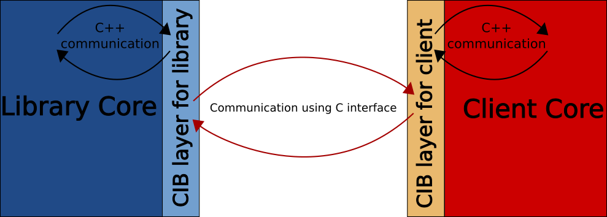

Component Interface Binder (CIB)
================================

[](https://travis-ci.com/satya-das/cib)
[](https://codecov.io/gh/satya-das/cib)
[](https://app.codacy.com/app/satya-das/cib?utm_source=github.com&utm_medium=referral&utm_content=satya-das/cib&utm_campaign=Badge_Grade_Settings)
[](https://opensource.org/licenses/MIT)

# CIB

**In a nutshell CIB is the answer to the problem for which C is used for exporting APIs of an application/library even when the application/library itself uses C++ for most of its implementation. C++ is great in expressing API but compiler generated ABI makes it difficult to use to publish compiler independent and ABI stable SDK.**

## Jargon
1. **ABI Compatibility**: Compatibility of binary C++ components even when they are built with different compilers.
2. **API Stability**: Ability to compile client of a library with newer SDK headers without any change.
3. **ABI Stability**: Ability of binary component to work with newer version of another component without recompiling. Example of ABI stability is the ability of a plugin (in binary form) of an application to seemlessly work with newer application.
4. **Forward Compatibility**: It is specific ABI stability where older library can work with newer client.
5. **Backward Compatibility**: It is specific ABI stability where newer library can work with older client.

**Note**: In this document when _ABI Stability_ is mentioned we will mean both forward and backward compatibility.

# Overview
CIB is an architecture to publish compiler independent and ABI stable C++ library.
This project is also about a tool that implements `cib architecture` automatically for given library headers.
CIB can also be used as plugin architecture of application.

# What is ABI
We programmers do have some understanding about `ABI`. The wikipedia also has [a page for ABI](https://en.wikipedia.org/wiki/Application_binary_interface). But I want to add another perspective about what exactly is ABI. **An ABI of a component is implementation details of features of the language in which the component is developed.** And this implementation detail depends on the compiler. For example, for a C++ component, we see mangled function names at binary level. The reason for that is C++ allows function overloading and compilers use name mangling to implement function overloading language feature of C++. In the same way all the implementation detail of other features of C++, like inheritance, encapsulation, runtime polymorphism, etc. end up being the ABI itself.

# CIB Features
- **ABI Compatibility** aka Compiler Independence: Library and clients can use their own choice of compilers.
- **ABI Stability**: Both new library with old client and old library with new client should be binary compatible.
- **ABI Resilience**: Virtual functions can be reordered in SDK without breaking ABI stability. With CIB there are other cases of ABI resilience too.
- **Perfect Isolation**: Clients can use library provided classes without access to original complete definition of library classes.

**CIB  allows client of a library to use all exported classes, as if those classes are part of the client code itself, without exposing the internals of classes.**

# CIB Goals
- Solution should be platform and compiler agnostic.
- Client that is written using traditional linking with library can easily migrate to **CIB**. This requires that CIB should be designed in such a way that it should not have any footprint in the code of client as well as library. There will of course be a small boiler plate code on both side but that's about it, the rest of the code should remain aloof about existence of CIB.

# Other Solutions
I have come across some solutions that try to solve the same problem but none of them is good enough. Some wants you to write separate layer on top of existing classes so that vtable is exported across component boundary in a portable manner or some exploits how compiler behaves and uses hacks to achieve goals or some is too specific to the project it was developed for.

- **CppComponent**: It basically uses hand written vtable to solve ABI problem. It looks like a clone of COM without idl. More details can be found here: https://github.com/jbandela/cppcomponents.
- **DynObj**: It exploits how compiler implements vtable. For details here: http://dynobj.sourceforge.net.
- **Libcef's translator**: Its a python script that parses C++ headers to produce automatic C layer for client and library. But it is too much specific to libcef and cannot be used in other project.

**And none of these solutions I am aware of are for ABI stability, they only target ABI compatibility for different compilers.** This is my understanding, of course I can be wrong.

# Why C++ has ABI compatibity and stability issues
Actually even C has this problem, it's just another matter that it is relatively easier to achieve ABI compatibility and stability in C.
Things that can cause ABI compatibility and stability issues in C++ are:
1. Object layout.
2. Function calling convention.
3. Allocators and deallocators.
4. Underlying integer size of `enum`.
5. Size of various integer types.
6. Mangled function name.
7. Virtual function table.
8. RTTI.
9. Exceptions.
10. Inheritance.

**_If you are reading this and think there are more reasons for ABI problem then please create a pull request._**

As we can see first 5 can also be problems in C. But if we ensure same struct packing, same function calling convention across component boundary, use of same allocator and deallocator for both components, ensure same underlying integer type for enum, and ensure to use same size for integers that cross component boundary then that's all it takes to ensure ABI compatibility for C programs. Achieving ABI stability too is simpler in C. We just need to ensure that new members in struct should be only added at the end and there should be a way to detect different version of struct. The `size` or `version` member in many struct are just for that purpose. Of course that's not the only thing but the other things are damn easy, like not to remove existing function, or not change parameter type, etc. if we want to maintain ABI stability.
For C++, problems start with name mangling, that's the first reason of misunderstanding that can happen between 2 components. Layout for C++ objects are far more complex than C. There can be different layout for virtual tables depending upon compiler. Same goes for RTTI and exception. So, ensuring ABI compatibility is hard in C++. Ensuring ABI stability is super hard in general.
**One thing to note is that maintaining ABI compatibility and stability in C is largely a responsibility of library developers.** Unfortunately that is not going to change even when CIB is used. But goal of CIB is to make it an easy and achievable to ensure ABI stability in C++.

# ABI Resilience
Some changes are conceptually unimportant for clients of a library but they break binary compatiblity. CIB makes client resilient against such changes and so client and library remain binary compatible even when such changes are made. Below is a list of changes that don't affect compatibility of client and library if SDK is published using CIB:
- Any change in internal data member of a class.
- Addition of new virtual methods anywhere in the class.
- Change in order of virtual functions of a class.
- Change in inheritance that doesn't violate previous is-a relationship. For example:
    - if a class starts deriving from one more base class without removing previous base class.
    - if a class changes it's base class to another derived class of it's previous base class.
    - inheritance type is changed to/from `virtual` inheritance.
- Change in `inline`ness of a function. For CIB generated SDKs all inline functions are basically non-inlined and so it doesn't make any difference if `inline`ness of a function is changed.

# CIB Architecture

## Core architecture concept
As we know language feature implementations end up being ABI, see [What is ABI](#what-is-abi), CIB provides different implementation of language features at component boundary in such a way that the ABI can be guaranteed to be compatible and easier to ensure stability. Graphically it can be depicted as:



## CIB Architecture Elements

 Following are the broad elements of CIB architecture:

- CIB architecture needs two sets of files that are created based on public headers that library wants to publish.
- One set of files, that is called library side glue code, should be compiled with the library.
- The other set should be used by the client of the library. This is client side glue code.
- Library side glue code defines free C style functions for all functions including class methods, constructors, and destructors.
- Implementation of such C functions are just to delegate the call to original function/method/constructor/destructor/etc.
- All C functions are assigned an integer value as its ID. This ID for a function will remain same across releases.
- For every class/struct/union/namespace a **MethodTable** is defined which is basically an array of function pointers.
- Library side glue code exports a C function that returns **MethodTable** for given class/struct/union/namespace ID.
- Class definitions for client is generated with same class-name but without any data member other than an opaque pointer to original class defined by library. In *CIB terminology* classes that are seen by client are called **proxy-classes** and the opaque pointer held by proxy-class is called **handle**. This is basically pimpl pattern (aka bridge pattern) with pimpl pointing to object across component boundary. **Note**: There is another kind of proxy class too, see Layout Sharing Proxy Class.
- Function ID is used as an index to fetch function pointer from **MethodTable**.
- Implementation of all functions including methods, constructors, and destructors of proxy classes are provided by means of invoking function pointer from MethodTable.

Above is only broad description of CIB architecture. For understanding each peice of CIB architecture please have a look at [Examples](examples). Each example tries to explain one peice of CIB architecture. Since this project is also about developing a tool that will automatically implement CIB architecture for a library the examples mentioned shows the code generated by CIB. Please be forewarned that little paitence will be required to analyse such code. :)

### Library Side Glue Code
The code that forms library side layer is called **library side glue code**. This layer contains the code to represent class as set of free functions. These free functions for a class are bundled together in an array. This array of pointers-to-free-functions is called **MethodTable**. To avoid name mangling done by compilers that ruin the ABI compatibility, the library needs to export the MethodTable instead.

### Client Side Glue Code
The code that forms client side layer is called **client side glue code**. This layer contains the code to reconstruct the class back from the MethodTable exported by library.

[The rest of the details of CIB architecture can be understood with examples.](examples)

## CIB Architecture Detail
Details of CIB architecture is explained with various examples. Please see [Examples](examples) to know the details.

# Building CIB
## Get the source

```sh
git clone https://github.com/satya-das/common.git
git clone https://github.com/satya-das/cppparser.git
git clone https://github.com/satya-das/cib.git
```

## Configure and build

```sh
cd cib
mkdir builds
cd builds
cmake ..
make && make test
```

*Alternatively, if you prefer `Ninja` instead of `make`*:

```sh
cd cib
mkdir builds
cd builds
cmake -G Ninja ..
ninja && ninja test
```

# Demo Project
For working demo see projects **graphics** and **draw** in `demo/functionality` folder.

**graphics** is the library that provides definition of various shape classes, like Circle, Rectangle, etc.
**draw** is the client of **graphics** that uses it to draw various shapes.
Folder **graphics/pub** contains files that graphics library wants to make public.

When **cib** is run, which is done as pre-build step, it creates files in **graphics/cib** and **graphics/exp**. These generated files use files in **graphics/pub** as input.
Files in **graphics/cib** are meant for **graphics** library to compile with.
Files in **graphics/exp** are part of SDK of library and meant for client of **graphics**, in this case **draw** project to compile with.

Build **draw** and run it. Make changes in headers of **graphics** and build just **graphics_cibified** and run **draw_cibified**. Observe that non-breaking changes listed above don't make **graphics_cibified** and **draw_cibified** incompatible. But those changes make **graphics** and **draw** (the binaries that don't use CIB) incompatible.

# Feature Progress of CIB tool

| Feature                                   | Description | Status |
| ---------------------------------         | :---------- | :----- |
| Basic                                     | CIB should work for a simple library that exports classes with non-virtual functions. | Done |
| Virtual functions and inheritance         | CIB should make virtual function and inheritance available to clients. | Done |
| Function overloading                      | Same named functions of a class should be seamlessly exported. | Done |
| Function overridding                      | Allow library to use interface implemented by client. | Done |
| Forward compatibility of client           | Older client works with newer library. | Done |
| Forward compatibility of library          | Library should be ABI compatible with newer client. As of now library and client can catch exception when non existing function is called and should take corrective measures to work with newer component. | Done |
| Backward compatibility of client          | When newer client invokes a method present only in new SDK then std::bad\_function\_call exception will be thrown. Clients that want to be backward compatible should handle this exception when invoking methods present only in newer SDK. | Done |
| Backward compatibility of library         | When library invokes a method of interface implemented by only newer client then std::bad\_function\_call exception will be thrown. Library developer should be aware about this to remain backward compatible when invoking new methods of it's own public interface. | Done   |
| Create correct proxy class                | A base class pointer returned by an API of library may actually be pointing to an object of a derived class. At client side we should create proxy class of exact same type to which the returned pointer is pointing to. It is needed so that dynamic_cast at client side should work as expected. | Done |
| Operator overloading                      | It is common for C++ classes to have overloaded operators. | Done |
| Typecast operator overloading             | Typecast operator overloading of user defined types is common in C++. | Done |
| Simple Template class support             | Support for simple template classes when it crosses component boundary. Simple template means without template template argument, or any of other fancy stuff. | Done|
| Return existing proxy class               | If a function returns pointer or reference of object for which proxy class already exists then existing proxy class should be returned. | Done|
| Support protected methods                 | Protected methods are accessible to derived class and they should be exported so that client's derived class can call them. | Done|
| Support private pure virtual              | Private pure virtual is used in template method design pattern. | Done|
| Rvalue reference parameter                | RValue references need to cross component boundary. | Done|
| Support of free functions                 | Free functions in global and orher namespaces too should be supported. | Done |
| **Goal**: Use CIB in real production SDK  | To demonstrably prove viability of this architecture and tool it will be better to use it for at least one large production quality software. My plan is to use CIB for ObjectARX SDK of AutoCAD to demonstrate it's viability. | **IN PROGRESS** |
| **Phase1**: For AutoCAD SDK subset        | Make CIB work for ObjectARX SDK even when it requires changing of SDK headers to avoid problems of SDK and/or the tool. | **DONE** |
| **Phase2**: For complete AutoCAD SDK      | Improve tool so that only minimal change in ObjectARX SDK is required and that too only to avoid problems of SDK and not of tool. | **IN PROGRESS** |
| Support deleted members                   | Constructors and operators marked as `delete` should be deleted for proxy classes as well. ||
| Enum and enum classes                     | Enums used as parameter or return type. |
| STL classes                               | It is common for a C++ programs to use stl classes. CIB should make it possible to export STL classes in the same way it does for every other classes. |
| Support shared_ptr and unique_ptr         | Modern C++ programing expects these to be used more often. |
| Exception support                         | Make exception object travel across component boundary in a compatible way. |
| Function pointer as parameter             | Function pointers can be used as parameter or return type of another function. ||
| Support std::function                     | std::function can be used as function parameter or return type. They too should be supported. ||
| Support for intrusive pointer             | Many libraries use intrusive pointer to manage object life cyle and functions can return smart pointer for intrusively managed reference count of object. |
| Non-const pointer ref return type         | When a reference of pointer of non-POD is returned from a function a change in that should be propagated to the library.|
| Support public data members               | Public data members of a class should be exported in ABI stable way. |

---

