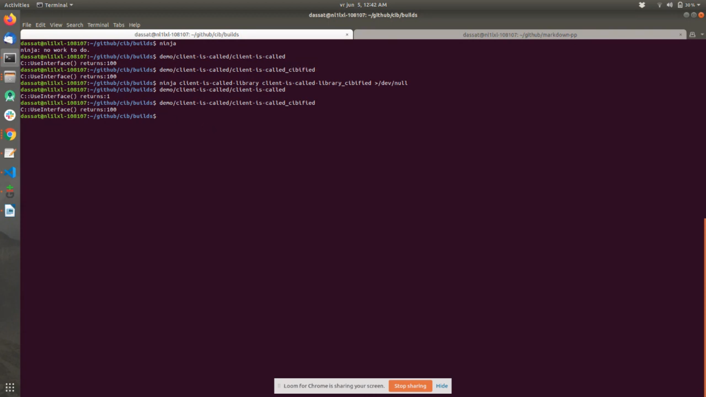

### ABI stability when interface is changed
A simple client library program to demonstrate CIB's capability that existing client remains compatible with new library even when interface used by library is changed.

